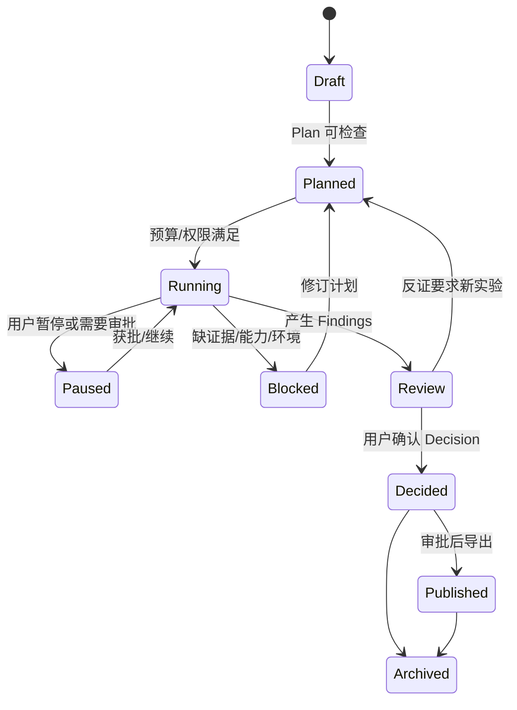

# Nana 用户旅程与功能系统

## 1. 设计单位：一次可审计的 Project Execution

Nana 的最小价值单位不是一条聊天、一篇摘要或一张知识卡，而是：

> 一个真实 Inquiry 经用户接受的 Plan 推进，产生带 Evidence locator 的 Finding、
> 可复现 Run、可继续使用的 Artifact，最终形成经用户确认的 Decision。

任何状态转换都写入 Event；任何外部写入、删除、发布和最终 Decision 都关联
Approval/Receipt。

## 2. 默认入口：从目标到可编辑计划

### 2.1 Capture

用户可以输入：

- 一个问题；
- 一个网页/PDF/仓库/本地文件；
- 一段代码、报错或实验结果；
- 一个“想学/想证明/想优化”的目标。

Nana 自动：

1. 判断数据级别并提示路由限制；
2. 识别可能的 Project Template；
3. 创建 Draft Inquiry，不立即执行高成本动作；
4. 用多视角问题补齐目标、成功标准、约束和反例；
5. 形成可编辑 Plan，列出动作、证据需求、预算、权限和停止条件。

用户必须能删改步骤、限制 Provider、降低预算或改变验收标准。

### 2.2 Plan Contract

每个 Plan 至少包含：

- `objective`：要回答/实现什么；
- `acceptance_criteria`：什么证据算完成；
- `steps`：有序或有依赖关系的 Action；
- `required_capabilities`：工具与模型能力；
- `data_policy`：数据级别和允许的 Provider；
- `run_budget`：时间、token、调用、CPU/内存、网络和存储；
- `approval_points`：必须停下的位置；
- `failure_policy`：重试、降级、终止；
- `expected_artifacts`：预期产物；
- `open_assumptions`：尚未证实的假设。

## 3. 三个端到端旅程

### 3.1 Algorithm Investigation

示例问题：

> 为什么可变长度滑动窗口通常依赖非负输入？引入负数后单调性在哪里失效，
> “和至少为 K 的最短子数组”为什么需要前缀和与单调队列？

旅程：

1. 用户确认问题、输入范围和期望深度；
2. Agent 检索公开可靠来源，保存 URL、标题、访问时间和段落 locator；
3. 建立“窗口左移不会降低和”等 Hypothesis；
4. 自动生成最小反例并运行性质测试；
5. 在代码编辑器中实现朴素、滑窗和单调队列版本；
6. 记录复杂度、正确性测试和 benchmark Run；
7. 把支持/反对证据与 Run 绑定到 Finding；
8. 用户确认 Decision，导出解释、代码、测试和可复用 Method。

失败必须可解释为：问题定义不完整、来源冲突、反例击穿、实现错误、资源超限或
环境失败，而不是统一显示“Agent 出错”。

### 3.2 Paper/Repo Reproduction

旅程：

1. 用户选择要复现的具体 Claim 和资源预算；
2. 导入 PDF 与 repo，保存原文件哈希、解析器版本、页码 locator、commit/symbol；
3. Agent 生成 Claim-to-Experiment matrix；
4. 用户编辑复现 Plan，确认数据、许可证、算力和停止条件；
5. 隔离环境中建立 baseline，锁定依赖；
6. 运行最小可行复现，再按预算扩展；
7. 对照论文表格/图、官方代码和实际结果；
8. 标记 reproduced / partially reproduced / not reproduced / inconclusive；
9. 输出复现报告、环境锁、patch、指标、失败证据和限制。

“无法复现”可以是有效 Decision，但必须能区分资源不足、实现不完整、原文不明确
和结果真正不一致。

### 3.3 Engineering Optimization

旅程：

1. 用户指定瓶颈、指标、质量护栏和硬件边界；
2. Nana 捕获 baseline 的代码、环境、输入、指标和 profile；
3. Agent 提出互斥或可组合的 Hypothesis；
4. 形成实验矩阵，一次只改变可解释变量；
5. 执行受控 patch、测试和 benchmark；
6. 比较性能、正确性、内存、稳定性和复杂度；
7. 检查回归、噪声和统计置信；
8. 用户接受 patch、要求更多实验或回退；
9. 输出 benchmark、Decision、patch 和可复用 Method。

## 4. 功能系统

### 4.1 Cockpit

- Goal 与 Project 列表；
- 今日需要用户处理的 Approval、Blocked、Failed Run；
- 正在运行的任务、预算和预计下一停点；
- 最近 Findings / Decisions；
- Capture Inbox；
- 后续版本显示跨项目复用机会和 CapabilityEvidence。

### 4.2 Project & Inquiry

- 创建、归档、恢复 Project；
- 多个 Inquiry 共存，但每次只突出一个 active Inquiry；
- 目标、约束、验收标准、假设和开放问题；
- Project Timeline 由 Event 派生，不手工维护重复状态。

### 4.3 Resource & Evidence

- 网页、Markdown、PDF、代码仓库、本地文件、数据集引用；
- 原始资源不可被解析结果覆盖；
- locator 支持 URL+段落、PDF 页码+区域、repo commit+symbol/line、数据 hash+row/key；
- parser/retriever/version 进入 provenance；
- Evidence 明确支持、反对或限制哪一个 Claim/Hypothesis；
- 引用打不开或 locator 漂移时标记 stale，不静默使用。

### 4.4 Plan & Agent Activity

- Agent 先产出 typed Plan，不直接开始无限执行；
- 步骤可增删、重排、暂停、重试、跳过；
- 每个步骤显示输入、输出、工具、Provider、费用、数据策略和副作用；
- “允许同类动作”创建受限 PolicyGrant；每个实际 Action 仍有独立 hash 与 Receipt；
- Activity 只显示可审计的行动摘要、证据和结果，不伪装隐藏思维；
- 关键变更支持 preview/approve/apply/receipt/undo。

### 4.5 Studio

- 资源树与 Artifact 树；
- Markdown/PDF 阅读；
- 代码编辑、diff、测试；
- 终端与 Run 日志；
- 表格、图、指标比较；
- Findings 与 Decision 编辑；
- 同一 Inquiry 的证据、计划、执行和结果保持上下文。

### 4.6 Run & Experiment

- 自动捕获 command/tool、代码版本、环境、输入、参数、随机种子、指标、日志、
  Artifact 和退出状态；
- Run 不可变，重试产生新 Run 并通过 `retry_of` 关联；
- cancellation、timeout、crash、budget_exceeded 都是正式终态；
- 比较是派生视图，不修改历史 Run；
- 可通过适配器同步到 MLflow/SwanLab/DVC/Jupyter。

### 4.7 Finding & Decision

- Finding 必须指出证据、Run、适用范围和置信来源；
- Decision 必须包含结论、接受/拒绝的备选方案、限制、反证和下一触发条件；
- Agent 可起草；最终 Decision 通过 `decision.confirm` T4 Action 确认，绑定
  Decision revision 与证据 manifest 的一次性 Approval，PolicyGrant 不得代批；
- 报告、笔记、图、模型、数据、代码包都统一为 Artifact。

### 4.8 Search & Reuse

`v0.4` 才完整实现：

- 按问题、方法、数据、指标、代码、证据和 Decision 搜索；
- 复用时保留来源 Project、版本和许可证；
- 失效依赖或过时证据提示重新验证；
- 不能把旧结论无条件复制到新问题。

### 4.9 CapabilityEvidence

首版只保存原始事件，不显示总分。后续可派生：

- 用户亲自确认的原理；
- 用户实现或主要修改的代码；
- 成功诊断的失败；
- 完成的迁移/优化；
- 在新情境复用并重新验证的方法。

每条能力证据都回到 Project / Run / Artifact / Decision；用户可以拒绝或修正归因。

### 4.9.1 Direction Portfolio

`v0.4` 可从同一证据派生方向探索视图，帮助尚未确定研究路线的用户观察：

- 反复主动选择的问题、方法、数据和指标；
- 已完成且愿意继续深入的项目；
- 能独立实现/调试/复现/优化的证据；
- 经常阻塞的知识、数学、工程和资源缺口；
- 候选领域与支持/反对证据；
- 下一项低成本“方向验证 Project”。

它不能用模型偏好直接宣布“你适合某领域”。候选方向必须显示 evidence、
counterevidence、数据量和不确定性，由用户决定是否用下一个 Project 验证。

### 4.10 Settings & Operations

- Workspace 位置与备份；
- Provider、模型与按任务 EvalPack 结果；
- 数据级别和项目策略；
- Capability Registry；
- ExecutionBackend 可用性；
- 默认预算和通知；
- 导入、导出、迁移 dry-run、恢复；
- 诊断包默认脱敏。

## 5. 功能分期

| 能力 | dev | alpha.1 | alpha.2 | beta | rc | v0.4 |
|---|---:|---:|---:|---:|---:|---:|
| Project/Plan/Run/Event/Approval | ● | ● | ● | ● | ● | ● |
| Cockpit + Studio 基础 | ● | ● | ● | ● | ● | ● |
| Markdown/Web Evidence | ○ | ● | ● | ● | ● | ● |
| 代码编辑、diff、测试 | ○ | ● | ● | ● | ● | ● |
| PDF 页码 locator | — | — | ● | ● | ● | ● |
| Repo commit/symbol | — | ○ | ● | ● | ● | ● |
| 环境锁与复现矩阵 | — | ○ | ● | ● | ● | ● |
| baseline/benchmark/profile | — | ○ | ○ | ● | ● | ● |
| 备份/迁移/恢复/安装 | ○ | ○ | ○ | ○ | ● | ● |
| 跨项目搜索复用 | — | — | — | — | — | ● |
| CapabilityEvidence UI | — | — | — | — | — | ● |
| Direction Portfolio（派生视图） | — | — | — | — | — | ● |

`●` 必须通过验收；`○` 只做支撑当前旅程的最小部分；`—` 明确不做。

## 6. 关键交互护栏

- 没有 acceptance criteria，不得开始自主长 Run；
- Plan 发生重要变化时必须生成 diff，不能静默漂移；
- Evidence 没有 locator 时只能标为线索，不能支持最终 Claim；
- 未知代码没有强隔离后端时必须审批；
- 非公开数据外发必须审批并显示目标 Provider；
- 最终 Decision、发布、删除不可自动确认；
- 用户暂停必须在可预期时间内停止新动作；
- 失败不得覆盖成功 Artifact 或修改历史 Run；
- UI 上的状态必须从 canonical 数据派生，不能维护第二套“看起来完成”的状态。

相关文档：[[04_界面重构与交互规范]]、[[05_技术架构与数据契约]]、
[[06_AI自治_安全与隐私]]。
