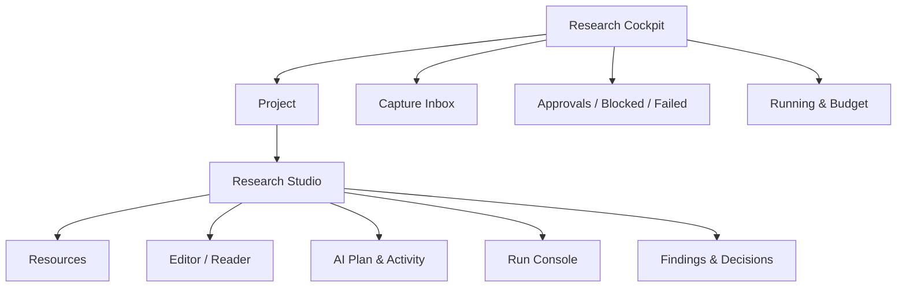

# Nana 界面重构与交互规范

## 1. 问题不是配色，而是信息架构

旧 UI 的主要缺陷：

- 用“研、迁、法、设”单字导航，语义弱；
- 以列表、详情和六个新增按钮暴露数据库对象；
- 阅读、代码、实验、AI 活动和产物互相割裂；
- 方法实验室是预置表单，不能承载真实项目；
- 长任务没有清晰状态、预算、暂停、失败恢复或 Receipt；
- 大面积空白和长文本使重要关系难以扫描。

因此不做“给旧 PySide6 换主题”。旧 UI 冻结用于迁移对照；新 UI 从任务结构重建。

## 2. 双层信息架构



### 层一：Research Cockpit

回答三个问题：

1. 现在最值得推进什么；
2. Nana 正在做什么、消耗多少、哪里失败；
3. 哪些事情必须由我决定。

### 层二：Research Studio

回答：

1. 这个项目的证据、代码和实验在哪里；
2. Agent 下一步要做什么、为什么需要这个动作；
3. 我如何直接阅读、修改、运行、比较和形成结论。

## 3. Cockpit 线框

```text
┌ Nana ────────────────────────────────────────────────────────────────┐
│ [Capture…]        Workspace: Personal        Search ⌘K     Settings │
├───────────────┬───────────────────────────────┬─────────────────────┤
│ Goals         │ Active Projects               │ Needs You           │
│ · 算法能力     │ Sliding-window boundary       │ 2 approvals         │
│ · 方向探索     │  running  42%  ¥/token budget │ 1 blocked run       │
│               │ Paper reproduction            │ 1 decision review   │
├───────────────┼───────────────────────────────┼─────────────────────┤
│ Recent Findings                              │ Running / Failed     │
│ · negative numbers break monotonic window    │ #R128 testing        │
│ · parser B preserved table coordinates       │ #R127 timeout ↻      │
├───────────────────────────────────────────────┴─────────────────────┤
│ Inbox: links, PDFs, repos, questions, logs                            │
└──────────────────────────────────────────────────────────────────────┘
```

设计约束：

- 默认只显示需要行动的信息；
- Failed/Blocked 不藏在日志深处；
- 每张 Project 卡显示当前 Inquiry、下一停点、预算和风险；
- Capture 一次接收文本/链接/文件，但先进入 Draft，不自动无限执行；
- 后续 CapabilityEvidence 只占一小块，不变成游戏化首页。

## 4. Studio 线框

```text
┌ Project / Inquiry ─────────────── Plan status ─ Budget ─ Pause ─────┐
├──────────────┬──────────────────────────────────┬───────────────────┤
│ PROJECT TREE │ TABS / WORKBENCH                 │ AI COPILOT        │
│ Inquiry      │ [paper.pdf] [solution.py] [diff] │ Plan 3/7          │
│ Resources    │                                  │ Next action       │
│ Evidence     │ PDF / Markdown / Code / Chart    │ Evidence used     │
│ Runs         │ with inline evidence anchors     │ Side effects      │
│ Artifacts    │                                  │ Cost & policy     │
│ Decisions    │                                  │ [Approve] [Edit]  │
├──────────────┴──────────────────────────────────┴───────────────────┤
│ TERMINAL | RUN LOG | TESTS | METRICS | PROBLEMS | ACTIVITY         │
└──────────────────────────────────────────────────────────────────────┘
```

### 左侧：项目结构

不是所有实体的平铺列表，而是当前 Inquiry 的工作上下文：

- Resources；
- Evidence；
- Plan；
- Runs；
- Artifacts；
- Findings；
- Decision。

支持按来源、任务或文件查看，但 canonical ID 不因视图改变。

### 中间：工作台

- PDF：页码、区域、引用锚点、解析层切换；
- Markdown：结构化笔记、Evidence/Claim 引用；
- Code：编辑、diff、symbol、测试；
- Table/Chart：Run 比较和 baseline；
- Decision：结论、备选、限制、触发重新评估条件。

中心区永远是用户正在处理的 Artifact，不被聊天流占满。

### 右侧：AI Copilot

显示：

- 当前 Plan 和进度；
- 下一 Action 的输入、输出和副作用；
- 使用的 Evidence 与未验证假设；
- Provider、数据级别、预算；
- 审批、编辑、暂停、跳过、重试；
- 可审计行动摘要。

不显示伪造的“内心独白”；解释应是可检查的理由、证据和风险。

### 底部：运行面板

- Terminal：用户或受控工具命令；
- Run Log：结构化 Event + 原始 stdout/stderr；
- Tests：失败定位和重跑；
- Metrics：baseline 与实验对比；
- Problems：解析、路径、权限、预算等问题；
- Activity：Agent 和用户动作时间线。

## 5. 核心交互

### 5.1 Capture → Plan

1. 输入问题/资源；
2. 预览识别结果和数据级别；
3. 选择或接受 Template 建议；
4. 补齐验收标准；
5. 检查 Plan、预算和审批点；
6. 启动。

默认按钮是“检查计划”，不是“全自动执行”。

### 5.2 Plan diff

Agent 修改正在执行的 Plan 时：

- 显示增加、删除、重排步骤；
- 标注预算、数据路由、权限和预期 Artifact 变化；
- 在原授权范围内的低风险调整可自动；
- 超范围变化进入 Approval。

### 5.3 Evidence citation

- 选择 PDF/网页/代码片段可创建 locator；
- 拖到 Claim/Finding 形成 typed Relation；
- locator 失效显示黄色 stale，不自动删；
- 双击引用回到原位置；
- 没有 locator 的内容标为 `lead`，不可成为最终引用。

### 5.4 Code change

- Agent 先产生 typed patch / diff；
- 可在 scratch 自动应用可逆 patch；
- 修改主分支、外部目录或未知 repo 前审批；
- 测试结果与 patch 绑定；
- 用户接受后生成 Receipt，可回滚。

### 5.5 Approval Center

审批卡必须说明：

- 要做什么；
- 为什么现在需要；
- 读取/写入哪些范围；
- 是否联网、发往哪个 Provider；
- 预算和最大时长；
- 可逆性与最坏后果；
- 允许本次 / 创建受限的 Project PolicyGrant / 拒绝。

“创建 PolicyGrant”不是把同一 Approval 套到未知动作上。UI 必须先展示能力、
参数模板、数据级别、目录、网络、单次/累计预算和有效期；随后每个实际 Action
仍计算独立 hash、再次经过策略判断并产生 Receipt。Grant 条件不匹配时重新审批。

“始终允许任意 shell”不是合法选项。

## 6. 状态与反馈

### Run 状态

canonical Run 状态为：
`queued / running / paused / succeeded / failed / cancelled / timed_out /
budget_exceeded / orphaned`。UI 可显示 `waiting_approval`，但它只是“Run 未处于终态
且至少一个关联 Action 为 `waiting_approval`”的派生 projection，不写入 Run
canonical 状态，也不改变 [[05_技术架构与数据契约#6.1 状态迁移注册表]]。

- 状态颜色只是辅助，必须有文字和图标；
- `orphaned` 表示进程中断后无法确认结束，不得伪装 failed/succeeded；
- 取消应立即阻止新工具调用，并在安全点终止当前动作；
- 长动作显示下一心跳、当前步骤和最后事件时间。

### 空状态

空状态必须指导下一真实动作，例如：

- “添加一个问题或资源以创建 Draft Inquiry”；
- “还没有 baseline；先运行一次可复现基线”；
- “没有可发布 Decision；先解决 2 个未验证假设”。

不使用纯装饰插画占据主要空间。

### 错误状态

错误包含：

- 用户能理解的一句话；
- 分类：输入/权限/网络/解析/工具/环境/预算/内部；
- 已完成和未完成的动作；
- 数据是否安全；
- 重试、换后端、修改计划或打开日志。

## 7. 视觉语言：Editorial Research Instrument

视觉概念 **MUST** 采用 **“编辑部研究仪器”**，而不是常见 AI SaaS、霓虹驾驶舱
或圆角卡片墙。具体字体文件、色值和材质仍是 **CANDIDATE**，必须通过 Windows
字体许可、包体、长时阅读、对比度和性能检查后锁定。

它结合：

- 学术期刊的排版秩序；
- 实验仪器的状态精确度；
- 工程 IDE 的高信息密度；
- 纸质研究笔记的温度。

用户最应记住的视觉特征是 **Provenance Rail（证据轨）**：资源定位、Claim、
Run、Finding 和 Decision 通过细线、编号和方向标记形成可追踪的纵向轨道。
它不是装饰，而是“这句话从哪里来、经过什么实验、由谁确认”的持续可见结构。

### 避免通用 AI 外观

- 不使用白底紫色渐变、发光球体或“AI magic”星光；
- 不把每段信息都塞进同尺寸圆角卡片；
- 不用聊天气泡支配 Studio；
- 不用模糊玻璃、过度阴影和无意义动效掩盖层级；
- 不用 Agent 头像和拟人情绪替代状态、证据和权限；
- 不以随机图标代替清楚文字。

### 字体方向

正式实现前验证 Windows 字体包体积、授权和中文覆盖。**CANDIDATE** 组合：

- 标题与长报告强调：`Source Han Serif SC`，产生学术编辑感；
- UI 与正文：`IBM Plex Sans` + `Source Han Sans SC`；
- 代码与 locator：`Maple Mono NF CN` 或经验证的等宽替代；
- 数值/指标使用 tabular numerals。

字体属于设计资产，不能依赖不同 Windows 机器上不可控的系统回退。若包体积不
可接受，保留经测试的系统 fallback，但仍锁定字号、字重、行高和数字宽度。

### 色彩与材质

主色 **MUST** 由“纸面 + 石墨”占据绝大多数，以下色值方向为 **CANDIDATE**：

| Token | CANDIDATE 方向 | 用途 |
|---|---|---|
| `paper-0` | 温和近白，不偏黄 | 主阅读面 |
| `graphite-950` | 近黑石墨 | 深色工作台/主文本 |
| `mineral-600` | 克制矿物蓝 | active / link / focus |
| `oxide-600` | 氧化橙棕 | assumption / stale / budget |
| `verdict-650` | 深绿 | verified / accepted |
| `hazard-650` | 暗红 | destructive / policy violation |
| `agent-600` | 冷青灰 | AI proposed、尚未接受 |

浅色模式像编辑桌，深色模式像仪器台；两者共享语义色，不是简单反相。

背景可使用极弱纸张噪点或 1px 实验网格，但必须：

- 不干扰代码/PDF；
- 低性能设备自动关闭；
- reduced-motion/high-contrast 模式完全移除；
- 不成为截图“效果”而牺牲长时间阅读。

### 空间与边界

- 基础采用 4px 原子、8px 主节奏；
- Cockpit 可以用不对称 editorial grid，Needs You 比装饰统计更突出；
- Studio 使用受控密度，中心工作台占主导；
- 主要边界靠排版、hairline 和背景层级，不靠厚重卡片阴影；
- 右侧 AI 面板在无动作时可以收窄为 Plan Rail，避免持续抢占空间；
- Provenance Rail 与 editor gutter 对齐，使定位和行动形成统一视觉语法。

### 组件词汇

首批组件不按通用“Card/Button/Modal”命名产品语义，而建立：

- `InquiryHeader`：问题、验收标准、状态和预算；
- `PlanRibbon`：可编辑步骤、分支和审批点；
- `EvidenceAnchor`：locator、方向、stale 状态；
- `ProvenanceRail`：Evidence → Run → Finding → Decision；
- `RunPulse`：运行状态、最后心跳、资源和下一停点；
- `ApprovalSheet`：副作用、范围、预算、可逆性和选择；
- `DecisionSeal`：用户确认、限制和重新评估条件；
- `ArtifactTab`：文件、代码、图表和报告的统一容器。

底层仍可由通用 primitive 构成，但产品层禁止“card soup”。

### 动效

- 首次进入 Project：资源树、工作台、Plan Rail 按信息依赖顺序轻微出现；
- Evidence 被引用时，Provenance Rail 做一次短促路径高亮；
- Run 状态变化沿 PlanRibbon 移动，不弹跳庆祝；
- Approval 进入时冻结相关 Action，并把变化 diff 固定在视线内；
- 动画时长短、可中断；reduced-motion 下改为即时状态变化。

### 语义色

| 语义 | 用途 |
|---|---|
| blue | active / information |
| green | verified / succeeded |
| amber | assumption / waiting / stale |
| red | destructive / failed / policy violation |
| violet | AI proposed, not yet accepted |
| gray | archived / derived / inactive |

## 8. 可访问性和效率

- 键盘：`Ctrl/Cmd+K` 全局搜索，`Ctrl/Cmd+P` 资源，`Ctrl+Shift+P` 动作；
- 焦点顺序稳定，所有按钮可由键盘触达；
- 颜色对比达到 WCAG AA；
- 图表有表格/文本替代；
- PDF locator 可读出页码与区域；
- 中文与英文混排不截断；
- Windows 125%/150% 缩放和不同 DPI 必测；
- 布局支持保存为 workspace preset；
- 终端与日志可复制脱敏片段。

## 9. 前端验收

每个里程碑至少执行：

- 对应旅程的 Playwright 端到端测试；
- 截图差异仅用于发现变化，不独立证明可用；
- 键盘导航测试；
- 125%/150% DPI 和窄窗口测试；
- offline/provider failure/sidecar crash 状态测试；
- 取消、恢复、审批和 undo；
- 真实项目的 30 分钟观察式使用，严格执行
  [[07_版本路线图与验收门槛#C. 30 分钟观察式可用性]]：用户完成
  `create→plan→run→approve→artifact`，最多 2 次澄清、状态问答至少 8/10，且无
  成败/审批/已提交数据的关键误解。

UI 质量不是“看起来漂亮”，而是用户能不理解底层表结构也完成旅程。
