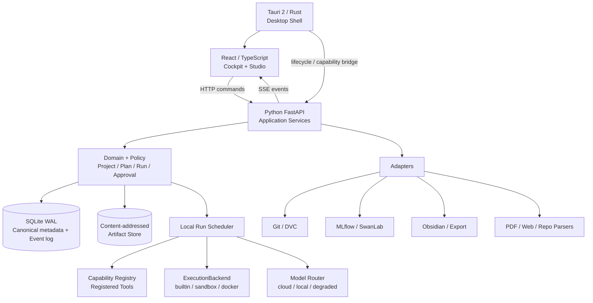

# Nana 技术架构与数据契约

> [!important] 当前 D3 权威（2026-08-13）
> 唯一当前实现与验证权威为 `C:\Users\q1968\Desktop\Nana\docs\CURRENT_D3_AUTHORITY.md`。
> 本文中与其冲突的旧 gate、重开说明和未勾选项只作为历史快照保留。

## 1. 为什么不能只用 Python

只用 Python 可以继续做原型，但难以同时获得：

- 复杂 IDE 级交互、成熟编辑器/PDF/虚拟列表生态；
- 稳定的桌面壳、窗口生命周期和细粒度系统能力；
- 科学计算、机器学习、解析和用户脚本的 Python 生态；
- 清晰隔离 UI、控制面、执行面与不受信代码。

因此采用少而清晰的多语言边界：

| 语言/技术 | 负责 | 不负责 |
|---|---|---|
| TypeScript + React | UI、状态投影、编辑器、可视化、交互测试 | 业务事实、直接数据库写 |
| Python 3.12 + FastAPI | 领域服务、Agent runtime、解析、科研工具、适配器 | 桌面壳权限、任意 UI 本地状态作为事实源 |
| Rust + Tauri 2 | Windows 桌面壳、sidecar 生命周期、受控系统桥、安装 | 科研业务规则、重复实现 Python 工具 |
| SQL migrations | canonical schema、约束、索引、版本迁移 | 临时 UI projection |

原则是“按生态分工”，不是为了技术炫耀。若 Tauri spike 失败，保留 React +
Python 本地 Web；不回到长期 Qt 双栈。

## 2. 逻辑架构



## 3. 物理进程与信任边界

### Desktop shell

- 启动并监控 UI 与 sidecar；
- 生成每次启动的本地认证 token；
- sidecar 只绑定 loopback 随机端口；
- 验证 API 健康、版本和 schema ceiling；
- 控制窗口、文件选择和受限系统能力；
- 崩溃时不直接判定正在运行的任务成功或失败。

### Python sidecar

- 唯一业务写入入口；
- 验证命令、策略、预算、版本和幂等键；
- 写 canonical SQLite 与 Artifact；
- 调度工具/模型/执行后端；
- 通过 SSE 发 Event projection；
- 不允许前端提交原始 SQL 或任意命令字符串。

### UI

- 发送 typed command；
- 根据 Event/Query 构建可丢弃 projection；
- 本地未保存编辑有明确 dirty 状态；
- 刷新或重启后从 canonical 数据重建；
- 乐观更新失败时回滚并显示 Receipt/错误。

### 浏览器 SSE 客户端

D1 的 HTTP SSE 契约使用 `Authorization: Bearer` 与精确 `Origin`。浏览器原生
`EventSource` 不能附加该 Authorization header，因此 D3 的浏览器客户端确定使用
`fetch + ReadableStream`，而不是原生 `EventSource`：

- 每次初连和重连都携带当前 Bearer session，并由浏览器产生的 Origin 通过精确校验；
- 客户端保存最后确认的稳定 Event ID，重连时传回 cursor，按 ID 去重；
- catch-up 与 live 共用同一有序消费路径；传输为至少一次，不声称网络层
  exactly-once，也不得因去重而跳过未处理 Event；
- 若 UI 与 sidecar 跨 Origin，Authorization/cursor 所需的 CORS preflight 只能允许
  本次启动的精确 Origin、method 与 header，并进入真实浏览器安全测试；
- 若以后改用 cookie、bootstrap exchange 或其他安全会话，必须另开安全 ADR 并重新
  通过 Host/Origin/CORS/CSRF/token replay 门，不能在 D3 实现中隐式改约。

HTTP 路由鉴权采用默认拒绝：runtime 对所有 HTTP 路由先要求同一 Bearer session 与
精确 Origin，只按精确路径显式放行 `/healthz`、`/api/v1/handshake`、
`/openapi.json`、`/api/docs` 和 `/docs/oauth2-redirect`。新增业务路由不需要加入
“受保护集合”，默认即受保护；新增公共/bootstrap 路由才需要安全审查后加入放行
集合。放行不做尾斜杠归一化，`/path/` 不能先利用框架 redirect 绕过 `/path` 的
鉴权。D3 若增加 CORS middleware，preflight 必须在精确 Origin/header 门内另行处理，
不能把全部 `OPTIONS` 变成匿名通行。

### Local Web Plan B 的浏览器安全契约

本地 Web 不是“只绑定 localhost 就安全”。若 Tauri spike 失败，Plan B **MUST**：

- 由专用 launcher 绑定随机 loopback 端口，同时校验 `Host`；
- 默认拒绝 CORS，仅允许本次启动的精确 self-origin；
- 所有 mutation 校验 `Origin`、自定义 CSRF header 和短时会话；
- 启动 secret 至少 256-bit、单次使用；通过 URL fragment 交给首个页面，交换为
  只存在内存或 `HttpOnly + SameSite=Strict` 的短时凭据后立即清除 fragment；
- secret 不进入 query、Referer、日志、localStorage 或导出；
- 防 DNS rebinding：拒绝非明确 loopback Host/Origin；
- SSE 与 API 使用同一会话，重新连接需要重新认证；
- launcher 协调单实例与 workspace ownership；sidecar 在进入可写生命周期前取得并
  持有 workspace lock；浏览器心跳消失时，有 active Run 就继续 sidecar 但进入
  可重连状态，无 active Run 则按可配置 idle timeout 退出；
- 显式 Exit 会先处理 active Run，再关闭 sidecar；
- 恶意本地网页、CSRF、跨 Origin fetch、旧 token 重放和第二实例进入安全测试。

若 token 交换、Host/Origin、生命周期或重放测试未通过，本地 Web 只能用于开发，
不能成为正式 Plan B。

#### 2026-08-13 实现状态校正

真实交互启动器已改为由 OS 分配未占用的随机 loopback 端口；Bearer 不再写入 stdout。
launcher 以 URL fragment 把至少 256-bit 的单次启动 secret 交给首个页面，页面带精确
Origin 和 `X-Nana-Bootstrap` 换取内存 Bearer 后立即清除 fragment；同一 secret 重放
返回 401。静态首页/构建资产仅在该 bootstrap 模式下可匿名读取，其他 API 仍默认拒绝，
Bearer 只存在于 launcher/sidecar 与页面内存，不进入 query、Referer、localStorage、
日志或导出。

这关闭了“普通用户必须从终端复制 Bearer”与固定端口两项错误。后续整改又完成了显式
Exit/心跳/idle timeout/active Run 退出策略、启动后的第二 launcher 拒绝、恶意本地页面、
跨 Origin mutation、DNS rebinding 与 bootstrap replay 矩阵；当前边界以文末 authority 为准。

### D3 运行控制范围校正

- `PauseRun` / `ResumeRun` 已进入浏览器 allowlist、运行时、持久状态、UI 与 E2E；暂停期间
  timeout 预算冻结，并覆盖恢复、取消、关闭和崩溃恢复；
- `StartRunRequest.retry_of_run_id`、`runs.retry_of_run_id` 与 `run_retry_of_run` 已闭环，
  只接受同 Project/Inquiry 的 failed Run，字段与 Relation 在同一事务写入；
- reload/reconnect、cancel、Workspace lock、受控 T3 草稿导出、第二实例和 Local Web
  安全矩阵均已有当前机器证据，具体范围以 D3 final manifest 和当前 authority 为准。

### Executed process

- 与 sidecar 分离；
- 使用最小环境变量、限定工作目录、资源与网络策略；
- stdout/stderr 分片存 Artifact；
- 退出状态写 Run/Event；
- 不继承 Provider 密钥。

## 4. 稳定控制平面

| 对象 | 作用 | 关键字段 |
|---|---|---|
| Workspace | 本地事实与策略边界 | id, schema_version, data_root, policy |
| Project | 长期目标和资源集合 | id, title, status, data_class, created_at |
| Inquiry | 可回答的当前问题 | id, project_id, question, acceptance, status |
| Resource | 原始来源引用 | id, kind, uri/ref, hash, license, metadata |
| Artifact | 内容寻址产物 | id, media_type, blob_hash, size, producer_run |
| Plan | 用户可编辑的执行合同 | id, inquiry_id, revision, steps, policy, budget |
| Run | 一次不可变执行尝试 | id, plan_revision, state, backend, budget_snapshot |
| Action | 一个可授权、可执行的具体能力调用 | id, run_id, step_id, capability, args_hash, action_hash, risk, state |
| PolicyGrant | 一类 Action 的受限预授权 | id, project_id, capability, constraints, budget, expires_at |
| Event | 追加写的事实 | id, aggregate_type/id/version, actor, type, payload_ref, occurred_at |
| Approval | 对具体 Action 或 Grant 提案的选择 | id, subject_type/id/hash, risk, decision, expires_at |
| ActionReceipt | 已执行 Action 及实际副作用证明；UI 可简称 Receipt | id, action_id, authorization_ref, actual_effects, undo_ref |

这些对象从 `v0.3.0-dev` 起稳定。新增字段优先兼容扩展；删除或改语义需要 schema
迁移和读取上限。`PolicyGrant` 允许“本项目内满足这些约束的同类动作”，但每个
实际 Action 仍有独立 action hash 和 ActionReceipt；它不复用一次性 Approval。
本文后续出现的 `Receipt` 均指 canonical 对象 `ActionReceipt`，不是第二种记录。

## 5. 研究语义层

### 5.1 最小可实施字段

| 对象 | MUST 字段与约束 |
|---|---|
| Resource | `id, project_id, kind, logical_ref, content_hash?, media_type, data_class, license?, captured_at, status`；原始资源只追加 revision，不被 parser projection 覆盖 |
| Locator | `id, resource_id, locator_type, coordinates_json, quote_hash?, parser_id/version?, status`；coordinates 必须通过对应 locator schema |
| Claim | `id, inquiry_id, statement, status, revision, created_by`；statement 非空；默认 `draft` |
| Evidence | `id, inquiry_id, locator_id, direction, excerpt_hash?, status, created_by`；direction 仅 `supports/opposes/limits`；无有效 locator 只能为 `lead` |
| Hypothesis | `id, inquiry_id, statement, falsification_criteria, status, created_by` |
| Method | `id, project_id, name, preconditions, procedure_artifact_id, status, revision` |
| Finding | `id, inquiry_id, statement, status, confidence_basis, producer_run_id?, revision`；dev 只允许 `draft` |
| Decision | `id, inquiry_id, statement, alternatives, limitations, reevaluate_when, status, confirmed_by?, confirmed_at?`；只有用户可转为 `confirmed` |
| Relation | `id, type, source_type/id, target_type/id, producer_run_id?, created_by, status`；必须通过 Relation Registry |

`status` 采用注册枚举。任何覆盖 statement/coordinates/procedure 的修改创建新
revision；历史 Event 和 Relation 仍指向原 revision。

### 5.2 `v0.3.0-dev` 最小范围（原始范围快照）
本节记录最初纵向切片的最小范围；其中关于 Pause/Resume 与 `retry_of` 的“不能勾选”判断
已被 2026-08-13 D3 当前实现与验证块 supersede，不代表当前状态。

dev **MUST** 实现 Resource、Locator、Claim、Evidence、Hypothesis、Finding 和
Relation 的上述最小字段，因为纵向切片需要产生可追溯 Finding draft。
Method 可以先只支持最小记录；Decision 表和 command 可建 schema，但
`ConfirmDecision` 及完整 Decision UI 属于 alpha.1。

对应 Commands：

- `RegisterResource`
- `CreateLocator`
- `CreateClaim`
- `AttachEvidence`
- `CreateHypothesis`
- `DraftFinding`
- `CreateRelation`

alpha.1 才加入 `ReviewFinding / DraftDecision / ConfirmDecision` 的完整旅程。

`Source` 被拆为 Resource + locator；`Experiment` 由 Plan/Run 表达；旧 `Insight`
语义不清，迁移时只能成为 Draft Finding，不自动升级为 Decision。

## 6. 关系契约

采用注册的 typed Relation，不开放任意字符串知识图谱。

首批关系：

- `resource_contains_evidence`
- `evidence_supports_claim`
- `evidence_opposes_claim`
- `evidence_limits_claim`
- `hypothesis_tested_by_run`
- `run_produces_artifact`
- `run_produces_finding`
- `finding_informs_decision`
- `decision_accepts_method`
- `artifact_derived_from_artifact`
- `run_retry_of_run`
- `object_supersedes_object`

每个 relation type **MUST** 定义允许的 source/target、最小/最大基数、删除行为、
跨 Project 规则和校验错误。`出/入` 分别表示单个 source 的 outgoing 和单个
target 的 incoming 基数：

| relation type | source → target | 出 / 入 | Project 规则与删除行为 | 校验错误 |
|---|---|---|---|---|
| `resource_contains_evidence` | Resource → Evidence | `0..* / 1` | 必须由 Evidence 的 Locator 推导为同一 Resource；Resource tombstone 后关系保留，Evidence 转 `source_unavailable` | `E_REL_RESOURCE_MISMATCH` |
| `evidence_supports_claim` | Evidence → Claim | `0..* / 0..*` | 同 Inquiry；direction 必须为 `supports`；任一端 tombstone 时 Relation tombstone，不级联删除另一端 | `E_REL_EVIDENCE_DIRECTION` |
| `evidence_opposes_claim` | Evidence → Claim | `0..* / 0..*` | 同 Inquiry；删除行为同上；direction 必须为 `opposes` | `E_REL_EVIDENCE_DIRECTION` |
| `evidence_limits_claim` | Evidence → Claim | `0..* / 0..*` | 同 Inquiry；删除行为同上；direction 必须为 `limits` | `E_REL_EVIDENCE_DIRECTION` |
| `hypothesis_tested_by_run` | Hypothesis → Run | `0..* / 0..*` | 同 Project 且 Run 的 Plan 属于同 Inquiry；Run 不删除 | `E_REL_CROSS_PROJECT` |
| `run_produces_artifact` | Run → Artifact | `0..* / 0..1` | producer 一经写入不可改；Run 保留时 Artifact 可 tombstone 但 provenance 保留 | `E_REL_PRODUCER_EXISTS` |
| `run_produces_finding` | Run → Finding | `0..* / 0..1` | 同 Inquiry；Finding producer 不可原地替换，只能新 revision | `E_REL_FINDING_SCOPE` |
| `finding_informs_decision` | Finding → Decision | `0..* / 0..*` | 同 Inquiry；confirmed Decision 入边至少 1；不级联删除 | `E_REL_DECISION_EMPTY` |
| `decision_accepts_method` | Decision → Method | `0..* / 0..*` | 默认同 Project；跨 Project 必须显式导入 Method revision 和 license；不级联删除 | `E_REL_METHOD_SCOPE` |
| `artifact_derived_from_artifact` | Artifact → Artifact | `0..* / 0..*` | 允许跨 Project 只读引用；有向无环；任一 tombstone 时仍保留 lineage | `E_REL_CYCLE` |
| `run_retry_of_run` | Run → Run | `0..1 / 0..*` | 同 Project、source 创建时间更晚且无环；两端不可物理删除 | `E_REL_RETRY_INVALID` |
| `object_supersedes_object` | 同类型可修订对象 → 同类型对象 | `0..1 / 0..*` | source revision/时间必须更新且无环；旧对象转 `superseded`，不删除 | `E_REL_SUPERSEDE_INVALID` |

首版共同规则：

- canonical 对象使用 `RESTRICT` 物理删除，业务删除写 tombstone；
- Resource tombstone 不级联删除 Evidence；Evidence 转 `source_unavailable`；
- Finding 至少关联一个 Evidence 或一个终态 Run，dev 的测试 fixture 也不得例外；
- confirmed Decision 至少关联一个 Finding；
- 跨 Project relation 仅 `artifact_derived_from_artifact` 和后续 Registry 明确允许的
  复用关系可用；
- 未知关系进入扩展提案，不直接写 canonical 表。

### 6.1 状态迁移注册表

下表列出的边是唯一合法迁移；未列出的边统一返回
`E_STATE_TRANSITION(object_type, id, from, to, expected_revision)`，不得靠 UI
隐藏非法按钮代替服务端校验。

| 对象 | 初始状态 | 合法迁移 |
|---|---|---|
| Resource | `draft` | `draft→available/failed/tombstoned`; `available→stale/tombstoned`; `stale→available/tombstoned`; `failed→draft/tombstoned` |
| Locator | `draft` | `draft→valid/invalid/tombstoned`; `valid→stale/source_unavailable/tombstoned`; `stale/source_unavailable→valid/tombstoned`; `invalid→draft/tombstoned` |
| Claim | `draft` | `draft→in_review/superseded`; `in_review→verified/contested/rejected/draft`; `verified/contested/rejected→in_review/superseded` |
| Evidence | `lead` | `lead→valid/rejected/tombstoned`; `valid→stale/source_unavailable/tombstoned`; `stale/source_unavailable→valid/tombstoned`; `rejected→lead/tombstoned` |
| Hypothesis | `proposed` | `proposed→testing/superseded`; `testing→supported/falsified/inconclusive`; 任一结论态 `→testing/superseded` |
| Method | `draft` | `draft→validated/deprecated/superseded`; `validated→deprecated/superseded`; `deprecated→validated/superseded` |
| Finding | `draft` | `draft→in_review/superseded`; `in_review→accepted/rejected/draft`; `accepted/rejected→in_review/superseded` |
| Decision | `draft` | `draft→in_review/rejected/superseded`; `in_review→confirmed/rejected/draft`; `confirmed→superseded`; `rejected→draft/superseded` |
| Relation | `active` | `active→tombstoned`；tombstoned 后不可复活，恢复须创建新 Relation |
| Project | `active` | `active→paused/archived`; `paused→active/archived`；`archived` 只读终态 |
| Inquiry | `draft` | `draft→ready/cancelled`; `ready→active/cancelled`; `active→blocked/in_review/cancelled`; `blocked→active/cancelled`; `in_review→active/decided/closed`; `decided→active/closed`；`cancelled/closed` 为终态 |
| Plan | `draft` | `draft→proposed/superseded`; `proposed→approved/rejected/draft`; `approved→running/superseded`; `running→completed/superseded`；`rejected/completed/superseded` 为终态，新修改创建 revision |
| Artifact | `staged` | `staged→available/failed/orphan_quarantined`; `available→corrupt/tombstoned`; `corrupt→available/tombstoned`; `failed/orphan_quarantined→available/garbage_collected`；`tombstoned/garbage_collected` 为终态 |
| PolicyGrant | `proposed` | `proposed→active/rejected`; `active→revoked/expired/exhausted`；其余为终态 |
| Approval | `requested` | `requested→approved/denied/expired`；三者均为终态，Action 变化创建新 Approval |

Run 状态机：

```text
proposed → queued → running → succeeded | failed | cancelled | timed_out |
                           budget_exceeded | orphaned
queued → cancelled
running → paused → queued | cancelled | timed_out
```

Run 的所有终态不可离开；重试和恢复创建新 Run，并用 `run_retry_of_run` 连接。

Action 状态机：

```text
proposed → waiting_approval → authorized → running → succeeded | failed |
             │                  │                    cancelled | timed_out |
             └→ denied/expired  └→ cancelled         effect_unknown
proposed → authorized | denied
```

`effect_unknown` 是终态，必须人工或补偿 Action 处置，不能改写成 succeeded。

## 7. Evidence locator

| 资源 | Locator 最低字段 |
|---|---|
| Web | canonical URL, retrieved_at, content_hash, quote span/DOM anchor |
| PDF | artifact_hash, page, bounding box 或字符 span, parser/version |
| Repo | remote, commit, path, symbol 或 line span |
| Local file | artifact_hash, relative logical path, byte/line span |
| Dataset | dataset/version/hash, split, row/key/range |
| Run output | run_id, artifact_id, record/line/metric key |

locator 创建时保存短引用用于漂移检查，但不得用复制文字替代原资源。重新解析生成
新 projection，不修改历史 Evidence 的 provenance。

## 8. Artifact Store

以下是 **CANDIDATE** 逻辑结构；技术切片通过同卷 rename、恢复和 Windows 路径
测试后由 ADR 锁定：

```text
workspace/
  nana.db
  artifacts/
    sha256/ab/cd/<full-hash>
  runs/
    <run-id>/scratch/
  backups/
  exports/
  logs/
```

### 8.1 可见性不变量

SQLite 与文件系统不能共享一个真正原子事务，因此不声称“物理上永远没有孤儿
文件”。产品 **MUST** 保证：

> 读取者只能看到 `available` Artifact；任何崩溃窗口都可确定性恢复为
> `available / failed / orphan_quarantined`，不会让 canonical 对象引用不可读 blob。

### 8.2 Commit 协议

1. 在与最终 Artifact 同一文件系统的 staging 目录写 `.partial`；
2. flush/fsync（平台支持范围内），计算 hash、size 和 media type；
3. SQLite 事务写 `artifact_commit(state=staged, temp_ref, blob_hash, metadata)` 与
   outbox Event；业务对象此时不能引用为 available；
4. 若最终 hash blob 已存在，校验后复用；否则同卷 atomic rename 到最终位置；
5. 第二个 SQLite 事务把 commit 标为 `available`，再允许关系/查询暴露；
6. 发送 committed Event；清理临时记录。

### 8.3 启动 reconciliation

| 崩溃窗口 | 启动处理 |
|---|---|
| DB staged 前只有 partial | 超过 grace period 后移入 orphan quarantine |
| DB 为 staged、partial 完整 | 完成 rename，再标 available |
| DB 为 staged、最终 blob 已在 | 校验 hash/size 后标 available |
| DB 为 staged、两者都缺失/损坏 | 标 `failed`，业务引用保持不可见 |
| DB 为 available、blob 缺失 | 标 `corrupt`，进入恢复流程，不返回空内容 |
| 只有最终 hash blob、DB 无记录 | 进入 orphan quarantine，按 retention 清理 |

staging、最终 blob 和数据库位于同一受控 Workspace 卷；跨卷导入先复制到本卷。
reconciliation 幂等，且每个分支有故障注入测试。

#### 单 reconciler 与 Workspace 锁不变量

- 同一 canonical Workspace 在任一时刻最多有一个可写 sidecar owner，也最多有一个
  reconciler；reconciliation 不与第二个 reconciler 或 Artifact commit/promote
  并发；
- sidecar 必须在以可写方式打开 canonical SQLite、运行 migration/reconciliation
  或接受 mutation 前，按解析后的 Workspace 身份获取非阻塞、进程级排他的 OS lock；
- lock 从 reconciliation 开始前持续持有，直到停止接收新写入、所有写者静止且
  SQLite 关闭后才释放；进程崩溃时由 OS 释放，第二实例获取失败必须失败关闭，不能
  降级为无锁写入；
- launcher 只有在 sidecar 报告 lock 已取得且启动 reconciliation 收敛后，才把该
  Workspace 标为 ready；lock 的 Windows 路径/句柄实现、launcher/sidecar 崩溃与
  第二实例拒绝必须在生命周期工程单元中验证；
- 生命周期验证还必须锁定 OS lock、SQLite/WAL 的启动和关闭顺序：先持锁，再以可写
  模式打开数据库并 reconciliation；关闭时先停止 mutation/写者并关闭 SQLite/WAL，
  最后释放 lock；
- D1 当前证据只覆盖上述单 owner 模型，不证明两个 reconciler 或
  reconciler/commit 竞争安全。D2 可在同一单 owner 约束下继续；在 launcher/
  sidecar 生命周期建设前必须实现此锁及其测试。若要允许并发，则属于新的架构决策，
  必须另加竞争测试后才能放宽本不变量。

### 8.4 其他约束

- blob 以内容哈希寻址，元数据在 SQLite；
- canonical 数据不保存绝对用户目录作为可移植引用；
- 删除先进入 tombstone/垃圾回收队列，不直接级联丢失历史；
- Artifact 元数据记录 media type、size、hash、producer、license 和 retention；
- projection、cache 和索引可全部重建，不与 canonical 混淆。

## 9. Run 与 Event

### Run 不可变

Run 启动时冻结：

- Plan revision；
- 工具/模型/后端版本；
- policy 和 budget snapshot；
- 代码 commit/diff；
- 输入 Artifact；
- 环境摘要与随机种子。

“不可变”是指 Run identity、冻结输入、版本/策略/预算快照以及到达终态后的结果
不可覆盖。运行中的 `current_state` 是 Event 派生 projection，可按状态机前进。
重试、恢复或换后端创建新 Run，通过关系连接；历史 Run 不覆盖。

### Action

每个工具/模型/执行后端调用先创建 Action：

- `id, run_id?, plan_step_id?, capability_id/version`
- `args_artifact_id, args_hash, action_hash`
- `risk_tier, requested_effects`
- `policy_decision: auto / grant / approval_required / denied`
- `authorization_ref: policy_grant_id? / approval_id?`
- `state: proposed / waiting_approval / authorized / running / succeeded / failed /
  cancelled / timed_out / effect_unknown`
- `started_at, finished_at`

`action_hash` 覆盖 capability/version、规范化参数、数据级别、目录、网络、副作用和
预算。内容变化就成为新 Action；不能复用旧 Approval。

### Event 追加写

Event **MUST** 支持 Run 之前和之外的 Project/Inquiry/Plan 变化：

- `id`：全局单调可续订 ID；
- `aggregate_type, aggregate_id, aggregate_version`：乐观并发与对象历史；
- `run_id? / action_id?`：可选关联；
- `actor_kind: user / agent / system / tool` 与 `actor_id/version?`；
- `causation_id, correlation_id`；
- `type, payload_json 或 payload_artifact_id, occurred_at`。

同一 aggregate 的 version 唯一递增；Run 事件另有连续 `run_seq`。典型事件：

- `run.created / started / heartbeat`
- `plan.step.started / completed / failed`
- `action.proposed / authorized / started / output / completed / effect_unknown`
- `model.requested / response_recorded / degraded`
- `artifact.staged / committed`
- `budget.updated / threshold_reached`
- `run.paused / cancelled / timed_out / failed / succeeded / orphaned`
- `project.created / inquiry.created / plan.revised`
- `policy_grant.created / revoked / expired`
- `approval.requested / decided / expired`

写入顺序：

1. 验证 command 和幂等键；
2. SQLite 事务写领域变化 + outbox event；
3. 提交；
4. SSE dispatcher 发送；
5. UI 可从 event id 断点续订。

SSE 断线不影响事实写入；客户端重连后补齐。

## 10. Command / Query / Event API

### Commands

- `CreateProject`
- `CreateInquiry`
- `ProposePlan`
- `RevisePlan`
- `StartRun`
- `PauseRun`
- `CancelRun`
- `ProposeAction`
- `CreatePolicyGrant`
- `RevokePolicyGrant`
- `RequestApproval`
- `DecideApproval`
- `AuthorizeAction`
- `CommitArtifact`
- `RegisterResource`
- `CreateLocator`
- `CreateClaim`
- `AttachEvidence`
- `CreateHypothesis`
- `DraftFinding`
- `ReviewFinding`
- `DraftDecision`
- `CreateRelation`
- `ConfirmDecision`
- `PublishExport`

每个 Command 有：

- JSON Schema / generated TypeScript type；
- `command_id` 幂等键；
- expected revision；
- actor；
- policy decision；
- 成功时返回 `CommandResult(affected_revisions, event_ids)`，失败返回结构化错误。

只有实际执行的 Action 产生 `ActionReceipt`。Receipt 的 `authorization_ref` 可以是
一次性 Approval、PolicyGrant 或 T0/T1/T2 自动策略规则；不是所有 Receipt 都需要
`approval_id`。纯 Query 不产生 Receipt；只写 canonical 领域状态、没有外部副作用
的 Command 由 Event/CommandResult 审计。

### 最终 Decision 的授权闭环

`ConfirmDecision` 不是可由普通领域 Command 绕开的状态写入，而是内置 T4
Capability `decision.confirm` 对应的 Action。其 `action_hash` **MUST** 覆盖：

- Inquiry id；
- Decision id 与待确认 revision；
- Evidence/Finding manifest hash；
- alternatives、limitations 与 `reevaluate_when`；
- actor、risk tier 和预期当前状态。

Approval 的 subject 是该 Action 的 `id + action_hash`。`decision.confirm` **禁止**
由 PolicyGrant 预授权，每次必须取得一次性 Approval；Action 或 Decision 内容变化
立即使 Approval 失效。执行已授权 Action 时，服务在同一 SQLite 事务中调用
`ConfirmDecision` 领域处理器，写 Decision 状态、Event 和 outbox
ActionReceipt。用户点击“确认结论”可以是一个引导流程，但 Approval、Action 和
ActionReceipt 仍是三个可独立审计的记录。`publish` 与 `delete` 的 T4 Action 采用
同一原则。

### Queries

读模型可以按 UI 优化，例如 Cockpit summary、Project tree、Run comparison；它们
不接受写入，也不成为事实来源。

### API compatibility

- OpenAPI 生成 TypeScript client；
- UI 与 sidecar 在握手时比较 API/schema version；
- sidecar 新于 UI 时按兼容区间运行；
- 数据 schema 高于应用读取上限时只读打开并指导升级，不尝试降级写。

## 11. Adapter 接口

| Adapter | Nana 保存什么 | 外部系统负责什么 |
|---|---|---|
| ModelProvider | request policy、model id、usage、response artifact | 推理 |
| Retriever | query、结果 ref、score、版本 | 搜索/索引 |
| Parser | input hash、parser/version、output projection | PDF/Web/Office 解析 |
| Git | repo ref、commit、diff artifact | 源码版本 |
| DVC | data/model ref | 大文件 cache/remote |
| MLflow/SwanLab | external run id、同步 receipt | 专业 tracking/dashboard |
| Jupyter | notebook artifact、kernel/env ref | 交互计算 |
| Obsidian | export manifest、路径映射、receipt | 用户知识库 |
| ExecutionBackend | image/profile、limits、result | 隔离进程 |

Adapter 失败不能破坏 canonical Run；同步状态单独记录并可重试。

## 12. 迁移原则

- 冻结旧 PySide6 新功能开发；
- 可保留纯算法函数、测试和已验证 Claude adapter；
- 旧 SQLite 只读扫描，先输出 migration report；
- 无法无损映射的旧对象进入 archive JSON/Markdown，不猜测语义；
- 旧 Source 尝试变 Resource；有明确 locator 的关联才变 Evidence；
- 旧 Experiment 可作为 legacy Artifact/Run note，不伪造成可复现 Run；
- 新旧 UI 不长期双写；
- 技术切片成功后才迁移业务。

## 13. 测试与质量门槛

### 单元/契约

- schema constraints、state machine、policy、budget；
- relation registry；
- locator serialize/resolve；
- command idempotency；
- Artifact hash/commit protocol；
- generated TS/Python contract 一致。

### 集成

- SQLite crash/restart；
- SSE disconnect/replay；
- sidecar lifecycle；
- tool timeout/cancel/process tree；
- Approval 过期和绕过；
- adapter failover 不破坏事实。

### 端到端

- 三个 Plan Template；
- backup/migrate/restore；
- offline/provider failure；
- Windows 安装/升级/卸载；
- dirty editor 与 crash recovery。

### 性质/模糊测试

- 路径必须留在 allow-root；
- Event seq 单调且 Run 终态不可回退；
- 任意失败点都不向读取者暴露 unavailable blob，且 reconciliation 结果确定；
- 未批准动作不能产生副作用；
- projection 删除后可完全重建。

## 14. 架构决策门

| Gate | 通过证据 | 失败处理 |
|---|---|---|
| React + sidecar spike | dev 旅程连续 10 次 E2E；刷新/SSE 断线后 canonical 状态一致 | 不进入 Tauri |
| Local Web security | Host/Origin/CSRF/token 重放/恶意本地页面/第二实例测试全部拒绝；正常会话连续 20 次可启动 | 仅开发使用，不能当 Plan B |
| Tauri Windows spike | 20 次冷启动/正常退出、5 次 UI/sidecar 强制崩溃恢复、随机端口与打包全过 | 使用已通过安全门的本地 Web |
| Artifact protocol | 第 8.3 节每个崩溃窗口至少注入 20 次；0 次读到 unavailable blob；重扫均收敛 | 不迁移业务 |
| Runtime cancel | 30 个含子进程 fixture；取消后 250ms 内不再启动 Action，5s 内进程树退出或 Run 明确 `orphaned` | 自动执行保持关闭 |
| Event replay | 10,000 个混合 Event；断线/重连后 aggregate version、Run state、UI projection 完全一致 | 不迁移业务 |
| PDF adapter | 20 份代表性 PDF、每份 10 个预标注锚点；页码 100%，重新打开 ≥99%，表格/公式分别报告 | alpha.2 不发布 |
| Execution backend | 路径、网络、环境、进程、预算测试语料 0 个未拦截越权；结论仅限该语料 | 未知代码保持审批 |
| Migration | inventory 数量/hash 一致；dry-run 0 写入；迁移后备份恢复逐对象一致 | 旧数据只读归档 |

门槛的样本与阈值是 `v0.3` 初始发布合同。若真实使用证明不合适，只能通过 ADR
提高或重新定义并说明理由，不能在失败后静默降低。

相关文档：[[06_AI自治_安全与隐私]]、[[07_版本路线图与验收门槛]]、
[[08_迁移_备份_发布与恢复]]。
# 2026-08-13 D3 当前状态

当前契约已包含浏览器安全的 `PauseRun` / `ResumeRun`，以及 `StartRun.retry_of_run_id`；失败源校验、`runs.retry_of_run_id` 与 `run_retry_of_run` Relation 在同一事务落盘。唯一当前实现权威为 `C:\Users\q1968\Desktop\Nana\docs\CURRENT_D3_AUTHORITY.md`。
