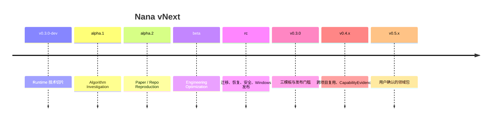

# Nana 版本路线图与验收门槛

> [!important] 当前 D3 权威（2026-08-17）
> 唯一当前实现与验证权威为 `C:\Users\q1968\Desktop\Nana\docs\CURRENT_D3_AUTHORITY.md`。
> 本文中与其冲突的旧 gate、重开说明和未勾选项只作为历史快照保留。
> 当前状态为 `acceptance_pending`、`d3_complete=false`；技术切片验证不能替代
> 尚未完成的 30 分钟目标用户观察式验收。

## 1. 路线图规则

用户没有固定每周工时，因此不承诺日历日期。路线图由四条规则控制：

1. 每个 milestone **只有一个端到端验收旅程**；
2. 未通过旅程时，不以完成页面、模型或接口数量冒充完成；
3. 新需求默认进入 backlog，不扩大当前 milestone；
4. stable 之前优先补可靠性、安全、迁移和打包，不继续堆功能。

建议的“专注开发日”只是容量估算，不是期限。一天指约 4–6 小时无打断开发。

## 2. 总览

## 3. `v0.3.0-dev`：统一 Runtime 技术切片

> [!warning] 2026-08-13 退出状态重开（整改前历史快照）
> D3 的受限主旅程、10/10 成功与 25/25 浏览器矩阵已经存在，但此前的“D3 完整
> ACCEPT”没有覆盖真实用户安全启动、通用 Pause/Resume 和 failed→retry_of。
> 本轮关闭了随机端口、自动打开浏览器、一次性 fragment 换票以及 Bearer 不进 stdout；
> 其余两项和完整 Local Web 生命周期仍为未完成 gate（以上为整改前快照，已由文末当前状态
> supersede）。因此当时的 `v0.3.0-dev` 是
> **受限纵向切片通过、完整产品退出未通过**。

### 唯一旅程

一个真实算法 Inquiry 从创建进入：

`最小 Resource/Locator → Plan → 注册工具 Run → Event → Artifact → Finding draft
→ 审批后导出测试报告`

dev 使用一份人工提供或仓库内已有的公开 Markdown/代码资料和一个确定性测试，
只证明 Runtime、最小研究语义和审批链。它不承担完整检索、三种算法实现、
benchmark 或最终 Decision。

### 必须

- React/TypeScript + Python FastAPI 最小工作区；
- generated OpenAPI client；
- SQLite WAL schema：Project/Inquiry/Plan/Run/Action/Event/PolicyGrant/Approval/
  Receipt/Artifact；
- content-addressed Artifact Store；
- Resource/Locator/Claim/Evidence/Hypothesis/Finding draft/Relation 最小契约；
- Command 幂等、SSE 断点续订；
- registered tool 执行；
- pause/cancel/timeout/failed/orphaned；
- 可恢复 Artifact commit protocol；
- 最小 Cockpit、Studio、Activity；
- 一个真实算法问题；
- 一个真实 T3 审批：把无敏感内容的 draft report 写到用户选择的 Workspace 外
  测试目录；审批绑定精确 Action，完成后生成 Receipt。

### 不做

- PDF 全链路；
- 完整公开证据检索与争议分析；
- 三种算法实现和正式 benchmark；
- 用户确认的最终 Decision；
- 通用 repo 复现；
- MLflow/DVC 完整集成；
- 跨项目复用；
- CapabilityEvidence UI；
- 插件市场；
- 新 PySide6 页面。

### 退出证据

- 纵向 E2E 自动测试；
- sidecar 崩溃恢复；
- SSE 断线重放；
- 取消后无新 Action；
- 锁定测试语料内未审批副作用为零；
- 读取者看到 unavailable blob 为零，所有注入崩溃经 reconciliation 收敛；
- 用户能在 UI 中解释每个状态。

上项不得由自动化计数代替：发布前必须有观察式证据，证明用户能从 UI 区分至少
`draft/accepted/reconciled/running/paused/cancelled/failed/effect_unknown/Receipt`，并能
解释下一步；当前尚无该直接用户证据。

### D3 剩余退出项（2026-08-13）

- [x] 真实启动器随机 loopback 端口，普通用户无需构造 Authorization；
- [x] 单次 fragment bootstrap exchange，Bearer 不进 stdout/localStorage/export；
- [x] 独立 Pause/Resume command、执行语义、UI 与浏览器 E2E（已由当前 26/26 release matrix 验证）；
- [x] failed 新建 Run 并持久绑定 `retry_of_run_id`/`run_retry_of_run` 的 UI 与 E2E（已由当前 mutation 流程验证）；
- [x] browser close/heartbeat/idle timeout/active Run/显式 Exit 生命周期矩阵（已由当前 lifecycle/fault 流程验证）；
- [x] 第二 launcher、恶意本地网页、bootstrap 重放、CSRF、DNS rebinding 的完整产品矩阵（已由当前 security 流程验证）；
- [ ] 观察式用户状态解释证据：自动化 Cockpit/Activity、keyboard/DPI 与 Axe 验收已通过，
  但仍需真实用户按本文件“30 分钟观察式可用性”执行并保存 `UsabilitySession` Artifact。

历史 10/10、25/25、412 项与最终 manifest 仍是有效的固定快照证据，但不得作为上述
未覆盖条目的替代证明；入口代码改变后必须刷新 manifest 并重跑对应 release gate，
才能重新作出 D3 完整退出判断。

### 容量上限

不再把整个 dev 压成 8–15 日。按独立风险切片首次估算：

| 切片 | 上限（专注开发日） | Go/No-go |
|---|---:|---|
| D0 inventory + ADR + contracts | 3–6 | schema/API 可生成且契约测试通过 |
| D1 Artifact/Event runtime | 5–10 | 崩溃/reconciliation/SSE replay 通过 |
| D2 process/action/policy/budget | 5–10 | cancel 与零越权语料通过 |
| D3 minimal React E2E | 5–10 | dev 旅程连续 10 次通过 |

dev 初始总容量为 **18–36 个专注开发日**，每个切片独立停线。超出单切片上限就
缩小或重做该边界，不开始下一切片。完成 D0/D1 后用真实工时重估，不把估算当承诺。

### D0/D1 真实工时重估状态

2026-07-30 已按用户提供的实际专注时间完成数值重估。测试运行秒数、commit 时间戳
和自然日跨度没有被计入：

| 切片 | 实际专注小时 | 按 4–6 小时/日换算 |
|---|---:|---:|
| D0 | 2 小时 | 0.33–0.5 专注开发日 |
| D1 | 4 小时 | 0.67–1 专注开发日 |
| D0 + D1 | 6 小时 | 1–1.5 专注开发日 |

- [x] 分别补录 D0 与 D1 的实际专注小时；
- [x] 按本文件的 4–6 小时/专注开发日区间换算，没有制造虚假单点精度；
- [x] 根据实际值和后续风险重估 D2、D3 与 dev 剩余容量。

新的容量区间为：

| 切片 | 重估专注小时 | 换算专注开发日 | 依据 |
|---|---:|---:|---|
| D2 process/action/policy/budget | 8–16 小时 | 1.33–4 日 | 取 D1 实际工时的 2–4 倍，为进程树取消、并发、policy/budget 和故障恢复留宽缓冲 |
| D3 minimal React E2E | 6–12 小时 | 1–3 日 | 取 D1 实际工时的 1.5–3 倍，覆盖真实浏览器 Bearer/Origin/CORS、fetch SSE、重连与连续 10 次旅程 |
| D2 + D3 剩余 | 14–28 小时 | 2.33–7 日 | 不含独立的 Tauri spike |
| D0–D3 总量（含已发生） | 20–34 小时 | 3.33–8.5 日 | D0/D1 使用实际值，D2/D3 使用上述重估 |

样本只有 D0/D1 两个切片，因此这些仍是容量区间，不是日历承诺。D2 继续保持独立
停线；D2 完成后再用实际工时校正 D3。浏览器 SSE 客户端实现和 Workspace lock
runtime 分别属于 D3 与 launcher/sidecar 生命周期，不阻断单 Workspace owner
约束下的 D2。

## 3.1 `v0.3.0-dev.tauri-spike`：桌面壳决策门

它在 dev Web 旅程通过后单独进行，不是 dev 产品验收的附加功能，也不进入
alpha.1 业务范围。

- 5–10 个专注开发日上限；
- 按 [[05_技术架构与数据契约#14. 架构决策门]] 完成冷启动、崩溃、端口、打包；
- 通过则采用 Tauri；失败则只有在 Local Web security gate 通过时采用 Plan B；
- 两者都失败就暂停正式迁移，不回旧 Qt 堆功能。

## 4. `v0.3.0-alpha.1`：Algorithm Investigation

### 唯一旅程

真实算法问题产生公开证据、Hypothesis、反例、实现、测试、复杂度/benchmark、
Finding 和用户确认的 Decision。

### 必须

- Web/Markdown Resource 与 locator；
- Evidence 支持/反对/限制关系；
- Plan 编辑和 diff；
- Code editor、diff、受控测试；
- 反例/性质测试；
- Run 比较；
- Decision 审批；
- 导出 Markdown + code + tests；
- 首个 CapabilityEvidence 原始事件，但无总分 UI。

### 不做

- PDF parser；
- 完整 notebook；
- 自动课程；
- 跨项目方法推荐；
- 多 Agent 常态长辩论。

### 退出证据

- 用户在实施前确认真实问题；
- 至少一个 Hypothesis 被反例推翻或明确经反例搜索；
- 所有最终 Claim 有 locator 或 Run；
- 正确性测试与复杂度结论可重放；
- 用户能修改 Agent Plan 并看到差异；
- 报告无 unsupported citation。

### alpha.1 三项可判定协议

#### A. 反例搜索

开始相关 Run 前，用户先批准 `CounterexampleSearchContract`，至少冻结 input
domain、generator、seed、case budget、time budget、shrinker 与重放命令。满足下列
之一才算执行完成：

1. 找到反例，最小化后可用冻结环境重放；或
2. 完整耗尽批准预算；有可枚举的小有界域时必须穷举，同时至少运行 10,000 个
   property-based cases。

“未找到反例”只能形成带输入域和预算范围的 Finding，不得写成正确性证明。

#### B. unsupported citation 扫描

最终报告中的每一条外部可验证事实陈述必须满足以下之一：

- 关联 typed Evidence 或终态 Run，locator 可重新打开且方向与陈述一致；
- 显式标为 `Hypothesis / Opinion / Unverified`，不得参与 verified Claim。

alpha.1 的唯一最终报告由用户逐条审阅全部事实陈述；任何未标记且无支持记录的
陈述使 milestone 失败。扫描结果、resolver 版本和人工审阅结果保存为 Artifact。

#### C. 30 分钟观察式可用性

同一名目标用户和一名仅观察的记录者，从空 Inquiry 完成
`create → plan → run → approve → artifact`，不得查看数据库或用 CLI 修复产品
流程。通过条件必须同时满足：

- 30 分钟内完成；
- 记录者最多提供 2 次澄清，不代为操作；
- 用户对 10 个状态问题至少答对 8 个；
- 对“成功/失败、正在等待的审批、哪些数据已提交”无关键误解；
- 外部工具只可用于阅读源材料，不可充当 Nana 工作流绕路。

录屏/观察表、问题答案、停顿和绕路形成 `UsabilitySession` Artifact。未满足任一项
即失败，不得用“用户大体理解”替代。

### 容量上限

建议 12–22 个专注开发日。若 locator 或代码执行契约不稳定，停止增加可视化。

## 5. `v0.3.0-alpha.2`：Paper/Repo Reproduction

### 唯一旅程

选择一篇**带官方或作者参考仓库**、可在本机/预算内完成的论文，完成一个具体
Claim 的最小复现并说明复现程度。首验收对象故意同时验证 PDF locator 与 repo
commit/symbol；stable 以后才把 paper-only 或 repo-only 变为条件化路径。

### 必须

- 原始 PDF Artifact；
- parser adapter 与版本；
- page/bbox/span locator；
- repo commit/path/symbol locator；
- 环境锁定；
- Claim-to-Experiment matrix；
- baseline 与结果比较；
- parser failover 不破坏旧 projection；
- reproduced/partial/not/inconclusive Decision；
- 可导出复现包。

### 不做

- 任意论文全自动训练；
- 数据许可证自动判断替代人工；
- 全自动论文写作；
- 多用户协作；
- 自建大规模文献索引。

### 退出证据

- 样本 PDF 的 locator 可重新打开；
- 解析失败可替换 adapter 并保留历史；
- 代码/依赖/数据/随机种子/指标齐全；
- 资源不足时产生诚实的 inconclusive，而不是伪成功；
- 复现报告由另一个读者按步骤运行到预先声明的同一方向、数量级和容差范围；
- PDF locator 达到架构门定义的 20×10 样本阈值。

### 容量上限

建议 18–35 个专注开发日。只选一个计算可承受、许可清楚的复现对象。

## 6. `v0.3.0-beta`：Engineering Optimization

### 唯一旅程

对 Nana 自身或一个小型算法项目做真实性能优化，形成 baseline、patch、实验矩阵、
回归和接受/回退 Decision。

### 必须

- baseline、profile、参数/指标；
- typed patch 与变更集；
- 多 Run 比较、分组和置信提示；
- 正确性/性能双护栏；
- 回归测试；
- 至少一个外部 tracking adapter 的窄集成，或证明内置比较足够；
- undo/rollback Receipt；
- Engineering Optimization 模板通过。

### 不做

- 完整 MLOps；
- 分布式调度；
- 云 GPU 市场；
- 自动部署生产；
- 领域专用 Agent 群。

### 退出证据

- baseline 可重跑；
- 只改变声明变量；
- 固定环境 warm-up 后至少 10 次重复；bootstrap 95% CI 不跨 0，且相对收益
  ≥ `max(5%, 2 × baseline CV)`；
- 正确性/内存/稳定性护栏通过；
- patch 可回退；
- Decision 说明被拒绝方案。

### 容量上限

建议 15–30 个专注开发日。只接一个 tracking adapter，第二个进入 backlog。

## 7. `v0.3.0-rc`：可靠性与发布

### 唯一旅程

同一个真实 Workspace 完成：

`备份 → 升级 → 模拟崩溃 → 恢复 → 安全审计 → 卸载/重装 → 数据仍在`

### 必须

- schema ceiling；
- migration dry-run 与报告；
- 自动备份、校验、恢复演练；
- sidecar/执行进程崩溃恢复；
- capability/policy/security suite；
- Windows 安装、升级、卸载；
- 数据目录不变性；
- offline/safe mode；
- 诊断包脱敏与预览；
- 文档、首次运行、Provider 失败体验。

### 不做

- 任何新用户功能；
- 新 Template；
- 新模型生态；
- UI 大改；
- 云同步。

### 退出证据

- 完整发布清单全绿；
- 真实旧数据副本迁移并可恢复；
- 锁定安全语料内未拦截越权执行为 0；
- 50 个 canary 场景中凭据泄露到 Prompt/log/child env/export 为 0；
- 崩溃不丢已提交数据；
- 卸载不删除 Workspace；
- 新版本无法理解更高 schema 时只读打开。

### 容量上限

建议 15–30 个专注开发日。发现严重安全/数据问题时延迟 stable，不削门槛。

## 8. `v0.3.0` stable

没有新的产品能力。它是 dev 至 rc 的共同门槛：

- Algorithm Investigation 通过；
- Paper/Repo Reproduction 通过；
- Engineering Optimization 通过；
- 可靠性、安全、迁移、恢复、Windows 打包通过；
- 真实用户完成至少三次 Project Execution 并愿意继续使用；
- 已知限制写入 release notes；
- 未通过项不能用“beta”措辞隐藏后发布 stable。

## 9. `v0.4.x`：复用与能力证据

### 唯一旅程

一个新 Project 找到、审查并复用旧 Project 的 Method/Artifact，重新验证后产生新
Decision，并形成用户认可的 CapabilityEvidence。

范围：

- 跨项目检索；
- provenance-aware reuse；
- 过时/失效提示；
- CapabilityEvidence 派生规则与用户确认；
- Direction Portfolio：候选领域、支持/反对证据与下一验证 Project；
- Project portfolio；
- 可导出的能力证据包。

不做社交、排行榜、招聘评分或 AI 断言人格/潜力。

## 10. `v0.5.x`：领域包

只有用户研究方向出现稳定信号后开始。一个领域包包含：

- 领域 Resource/Claim/Metric 类型扩展；
- Template；
- Tool/Parser/Benchmark adapter；
- EvalPack；
- 示例 Project；
- 迁移和禁用方式。

首个领域由真实项目证据决定，不由当前规划猜测。

## 11. 反馈与版本迭代机制

每次真实使用记录：

- 完成旅程所需人工步骤；
- Agent 被拒绝/修改的 Plan；
- 无法定位或过时的 Evidence；
- Run 失败分类；
- 超预算原因；
- UI 绕路和用户在外部工具完成的步骤；
- 可复用 Artifact；
- 安全/隐私事件。

每个 milestone 结束只回答：

1. 唯一旅程是否通过；
2. 哪个假设被证伪；
3. 下一版本最重要的可靠性债是什么；
4. 哪些需求因 scope ceiling 顺延；
5. 是否仍需要当前技术边界。

## 12. 发布分支与版本语义

- `dev`：内部结构可迁移；
- `alpha`：单个模板可用，存在已知限制，但数据不能损坏；
- `beta`：三个产品旅程已覆盖，集中处理兼容与可靠性；
- `rc`：禁止新增功能；
- `stable`：发布门槛通过；
- schema migration 与应用版本独立编号；
- Artifact 格式带 producer/version；
- release notes 必须列迁移、回滚、数据影响和已知限制。

## 13. Stop-the-line 条件

出现以下任一项，停止扩功能：

- 未审批动作产生副作用；
- 引用无法回到原文却被标为 verified；
- Run 成功状态与真实进程/Artifact 不一致；
- 迁移或取消损坏 canonical 数据；
- 机密数据路由到未授权 Provider；
- milestone 超出唯一旅程；
- 新旧 UI 开始长期双写；
- 用户完成任务仍主要依赖外部手工拼接。
# 2026-08-13 D3 历史冻结（superseded）

D3 当前门禁已重新冻结：Python 418 passed / 2 skipped，Vitest 67/67，TypeScript 与生产构建通过，10/10 连续完整旅程通过，扩展发布矩阵 26/26（包含新的 Pause/Resume/Retry 浏览器旅程）。唯一当前权威为 `C:\Users\q1968\Desktop\Nana\docs\CURRENT_D3_AUTHORITY.md`。

# 2026-08-17 D3 当前状态

技术切片重新冻结为 Python 445 passed / 0 skipped、Vitest 67/67、projection
self-test、TypeScript、production build、10/10 连续完整旅程及 27/27 浏览器
release matrix，Playwright retries=0。运行时数据已迁出源码树，安装目录通过
212 项输出清单泄露门禁。D3 整体仍为 `acceptance_pending`、
`d3_complete=false`，唯一未关闭验收门是 30 分钟目标用户观察 Artifact。
