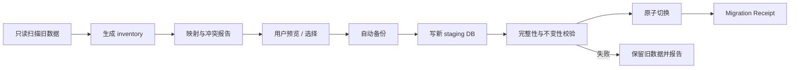

# Nana 迁移、备份、发布与恢复

## 1. 两类迁移不要混淆

1. **规划 Vault 替换**：把废版 `D:\Obsidian Vault\Nana_研究系统` 先做可恢复
   备份，再部署本套正式规格；
2. **应用数据迁移**：未来把 `v0.2.0-alpha` 的 SQLite/算法样例/研究记录导入新
   canonical schema。

本次总任务完成第一类；第二类在 `v0.3.0-rc` 前由真实 migrator 完成。

## 2. Vault 替换原则

- 不原地覆盖废版；
- 先把整个旧目录移动到带时间戳的 `_archive` 目录；
- 新文档从本地 staging 复制到原正式路径；
- 比较文件数和 SHA-256；
- 新目录可读后才宣告替换完成；
- 备份保留原文件名与目录结构；
- 不删除备份。

> [!success] 实际记录（2026-07-29 13:05:05 +08:00）
> - 旧目录已整体移动到
>   `D:\Obsidian Vault\_archive\Nana_研究系统_废版_20260729_130505`；
> - 旧版 7 个文件，tree manifest SHA-256：
>   `c54dd0eb79b5fd2561c0bf14d02ed1e8af3d3d9b5f05679973e69fc68dc78901`；
> - 备份与移动前 manifest 完全一致；
> - 新版 13 个文件部署到 `D:\Obsidian Vault\Nana_研究系统`；
> - 首次部署 tree manifest SHA-256：
>   `31b56ff9f65ddb7f5620c2f21c7badb20dbd1caf0a3277d3e4cbb55318d69e6e`；
> - 首次部署与本地 staging manifest 完全一致；终审记录写回后再做全树逐文件
>   manifest 比对。为避免文件把包含自身的 tree hash 写回后再次改变 tree hash，
>   最终 digest 只记录在任务执行结果中，本页登记可重放的比较方法与首次值。

## 3. `v0.2.0-alpha` 资产分类

| 资产 | 处理 |
|---|---|
| 纯算法函数与通过测试 | 保留为示例 Artifact/Fixture，逐项验证后复用 |
| 61 项现有测试 | 作为回归基线，但不能证明新架构正确 |
| Claude 只读共同设计 adapter | 保留并补安全、超时、Provider 兼容测试 |
| PySide6 UI | 冻结、截图和行为归档，不迁入新 UI |
| 旧 ResearchThread schema | 只读迁移源，不作为新 schema |
| Source | 有可靠引用时转 Resource；否则 archive |
| Claim | 转 Draft Claim，保留 provenance |
| Evidence | 只有可验证 locator 时转 Evidence；否则转 lead/note |
| Method | 转 Draft Method，补前置条件和版本 |
| Experiment | 不能伪造成新 Run；作为 legacy report Artifact |
| Insight | 转 Draft Finding，不自动成为 Decision |
| 旧刷题 DB/算法演示 | 示例 Artifact 或 archive，不迁移产品模型 |

## 4. 应用迁移流程

### Dry-run report

必须列出：

- 来源 schema/version/hash；
- 对象数量；
- 可无损迁移、需人工确认、只归档、冲突、损坏；
- 预计新增 Artifact；
- 磁盘需求；
- 目标 schema；
- 不可逆变化；
- 回滚方式。

### 写入

- 迁移不直接修改旧数据库；
- 目标写入 staging；
- Artifact 严格使用 [[05_技术架构与数据契约#8. Artifact Store]] 的两阶段
  commit/reconciliation；SQLite 与文件系统不被误称为一个原子事务；
- 迁移对象只能引用 `available` Artifact；
- 外键、关系、事件序列和内容哈希全部检查；
- 通过后原子切换 active manifest；
- 生成 Receipt。

### 回滚

- active manifest 指回旧工作区；
- 新 staging、`staged` commit 和 orphan quarantine 保留供诊断/reconciliation；
- 不尝试“反向迁移”修改旧库；
- 用户确认后再清理临时数据。

## 5. Schema ceiling

应用声明：

- `min_read_schema`
- `max_read_schema`
- `max_write_schema`

打开更高 schema：

- 不写；
- 进入 Safe/Read-only Mode；
- 允许导出；
- 清楚提示需要的应用版本；
- 不做自动降级。

迁移必须可重复执行且幂等；同一 migration id 不重复产生副作用。

## 6. 备份策略

### 备份内容

- canonical SQLite；
- Artifact manifest 与 blob；
- policy/config（不含可导出的明文密钥）；
- migration history；
- 必要索引版本信息；
- 用户自定义模板/规则。

### 不必备份

- 可重建 projection/cache；
- 临时下载；
- 已完成 Run 的 scratch；
- 可重新获取且无用户修改的安装文件。

### 备份类型

- 迁移/升级前强制快照；
- 每日增量或变更触发；
- 用户手动命名快照；
- 发布前可移植导出。

### 校验

- SQLite integrity check；
- manifest 与 blob hash；
- 随机抽样打开 Artifact；
- 在临时目录执行恢复演练；
- 记录备份工具和 schema 版本。

没有恢复演练的“备份成功”不算发布证据。

## 7. Obsidian 发布契约

Obsidian 是用户知识系统和发布目标，不是 Nana 的事务数据库。

### Export Manifest

- export id/time；
- Project/Decision/Artifact revision；
- 目标相对路径；
- 输出文件 hash；
- 冲突策略；
- Approval；
- Receipt。

### 冲突

- Nana 上次导出后用户未修改：可更新；
- 用户已修改：显示三方 diff，不能覆盖；
- 文件被移动：尝试按 embedded id 找回；
- 文件删除：询问是否重新发布；
- Obsidian 插件不可用：仍可导出普通 Markdown。

### Markdown

- frontmatter 保存 Nana object id/revision；
- locator 和 Artifact 使用稳定链接；
- 可读性优先，不把内部 Event 全部倾倒到笔记；
- 最终 Decision 和发布报告需用户审批。

## 8. Windows 发布

安装包必须：

- 显示应用版本、sidecar 版本和 schema 区间；
- 首次启动检查写权限、端口和数据目录；
- sidecar 仅 loopback；
- 升级前自动备份；
- 卸载默认保留 Workspace；
- 提供明确“删除用户数据”的独立高风险操作；
- 失败升级可回到前一应用版本；
- 日志和诊断包可由用户预览与脱敏。

## 9. 恢复场景

stable 前演练：

1. UI 强制关闭；
2. sidecar 在 Event 写入前/后崩溃；
3. Artifact blob 写到一半；
4. 执行子进程失联；
5. SSE 断线；
6. SQLite 事务回滚；
7. 磁盘空间不足；
8. Provider 超时/限流；
9. migration 中断；
10. 新应用打开更高 schema；
11. Obsidian 文件被用户修改；
12. 卸载重装。

预期：

- 已提交事实不丢；
- 半成品可识别和清理；
- Run 进入正确终态；
- 外部副作用有 Receipt 或明确 unknown；
- 用户有下一步，不只看到 traceback。

## 10. 完成清单

### 本次规划 Vault

- [x] 旧目录移动到可恢复 archive；
- [x] 记录旧文件数和 hash；
- [x] 新文档复制到正式路径；
- [x] 校验新文件数和 hash；
- [x] 打开索引并验证 wiki links；
- [x] 把实际备份记录写回本文。

### 应用 `v0.3.0-rc`

- [ ] inventory；
- [ ] dry-run；
- [ ] staging migration；
- [ ] invariants；
- [ ] atomic switch；
- [ ] rollback；
- [ ] schema ceiling；
- [ ] backup/restore drill；
- [ ] Windows upgrade/uninstall；
- [ ] Migration Receipt。

相关文档：[[05_技术架构与数据契约]]、[[07_版本路线图与验收门槛]]、
[[10_完整性_可行性_可执行性终审]]。
