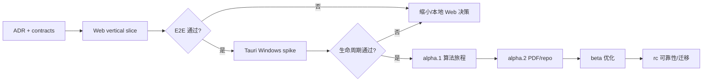

# Nana 完整性、可行性、可执行性终审

> [!important] 当前 D3 权威（2026-08-13）
> 唯一当前实现与验证权威为 `C:\Users\q1968\Desktop\Nana\docs\CURRENT_D3_AUTHORITY.md`。
> 本文中与其冲突的旧 gate、重开说明和未勾选项只作为历史快照保留。

## 1. 审计口径

本终审不以“文档很多”证明完成，而逐项寻找权威证据：

- 用户明确要求是否有对应决策；
- 对标结论是否来自官方版本史；
- 产品、UI、架构和版本之间是否一致；
- 每个承诺是否有测试或实施门；
- 未验证事实是否被误写为已完成；
- 下一步是否能由单人直接执行；
- 失败、隐私、安全、迁移和恢复是否进入主设计。

`pass-with-implementation-gates` 表示产品规划与执行路线已经通过终审，但尚未
实现的 Tauri、Artifact recovery、PDF、执行隔离和模型 EvalPack 仍必须通过各自
milestone gate；它不是“vNext 已经实现”的声明。

## 2. 明确需求覆盖

| 用户要求 | 权威证据 | 当前判断 |
|---|---|---|
| 寻找同类高质量项目 | [[02_对标平台与版本演进]] | 覆盖 9 类官方项目 |
| 参考版本迭代 | 每个项目的版本弧线与跨项目规律 | 已覆盖 |
| 对比 Nana 当前状态 | [[00_Nana_总览与导航]]、2026-07-29 的 61/61 测试输出、实机 UI 审查 | 已覆盖代码、历史、测试、UI 缺口 |
| 项目定位全面重构 | [[01_联合产品宪章]] | 已重定义 |
| 功能全面重构 | [[03_用户旅程与功能系统]] | 已按旅程与版本分期 |
| UI 全面重构 | [[04_界面重构与交互规范]] | 双层 IA、线框与验收齐全 |
| 可使用其他语言 | [[05_技术架构与数据契约]] | 明确 TS/Python/Rust/SQL 边界 |
| 高自治 | [[06_AI自治_安全与隐私]] | 能力、预算、审批、隔离与降级 |
| Windows 优先 | 架构、执行后端、发布门槛 | 已覆盖 |
| 方向未定 | 产品不绑定领域，v0.5 才做领域包 | 已覆盖 |
| Codex/Claude 平等 | [[09_Codex_Claude对等决策记录]] | 独立提案、互审、条件收敛如实记录 |
| 重要决策达成共识 | D1–D10 表 | 实质性条件收敛；最终 API 会签未返回已披露 |
| 旧 Vault 备份替换 | [[08_迁移_备份_发布与恢复]] | 待实际操作与 hash |
| 长期无固定工时 | [[07_版本路线图与验收门槛]] | 单旅程 scope ceiling |
| 完整性/可行性/可执行性复核 | 本文 | 待最终自动与读者验证 |

## 3. 架构一致性

### 主循环 → 对象

| 主循环阶段 | 控制平面 | 研究语义 | UI |
|---|---|---|---|
| 目标/问题 | Project, Inquiry | Claim | Cockpit/Capture |
| 研究/证据 | Resource, Artifact | Evidence | Reader/Resource tree |
| 假设/计划 | Plan | Hypothesis, Method | AI Copilot/Plan diff |
| 实现/实验 | Run, Event | Method | Editor/Terminal/Run |
| 比较/反证 | Run query, Artifact | Finding | Metrics/Evidence |
| 决策/交付 | Approval, Receipt, Artifact | Decision | Decision/Publish |
| 跨项目复用 | Relation/query | CapabilityEvidence | v0.4 Portfolio |

没有发现主循环阶段完全缺少对象或 UI 的情况。

### 自治 → 安全

- 自动 Action 必须来自 Capability Registry；
- PolicyGrant 表达受限预授权，一次 Approval 只绑定具体 subject/action hash；
- Registry 决定风险，Policy 决定是否审批；
- Run Budget 限制资源；
- ExecutionBackend 决定隔离能力；
- Event/Receipt 证明实际行为；
- UI 显示 Plan、动作、副作用、暂停和结果。

自治不是单独聊天功能，安全也不是发布前的外挂模块。

### 版本 → 验收

每个 milestone 只有一个旅程、必须项、不做项、退出证据和容量上限；rc 禁止新功能。
版本没有依赖未先建立的跨项目或领域功能。

## 4. 技术可行性

### 可行

- React/TypeScript、FastAPI、SQLite、SSE 和内容寻址存储都是成熟组合；
- Python 保留科研/算法生态，避免重写；
- Tauri 只在 Web 纵向切片成功后引入，失败有本地 Web Plan B；
- 现有 61 项测试和算法代码可作为回归资产；
- Git/DVC/MLflow/SwanLab/Jupyter 用适配器降低范围；
- 本机 CPU/GPU 型号足以验证有限本地模型路径，但不会被写成前沿等价承诺；
- Windows Sandbox/Docker 以可探测后端建模，缺失时有诚实审批降级。

### 未验证，必须用 spike

- Tauri 2 + Python sidecar 的 Windows 安装、生命周期和 crash recovery；
- Monaco/PDF viewer 与大文件的内存/性能；
- Windows 下受控进程树和取消的可靠性；
- Windows Sandbox 数据交换体验；
- 具体本地模型在 Nana EvalPack 的能力；
- PDF locator 在目标论文样本的稳定性；
- 旧 SQLite 数据实际迁移质量。

未验证项均有对应 milestone gate，没有被写成已实现。

## 5. 产品可行性

### 支持证据

- 对标项目一致趋向统一工作区、统一 runtime、可编辑计划、引用定位和可恢复运行；
- 三模板覆盖用户成为算法工程师所需的理解、复现和优化；
- 项目执行比“论文聊天/刷题/课程”更不依赖当前未知领域；
- 驾驶舱减少管理负担，Studio 承担深工作；
- Artifact/Decision 优先能避免聊天资产流失。

### 最大未知

用户是否愿意把真实项目持续放进 Nana，以及 Agent 的自动工作是否真正少于手工
拼接成本。必须用真实旅程观察，不可由方案推断。

### 产品退出标准

若三次真实项目后：

- 每次仍需大量手工建 Evidence/Run；
- 用户无法信任或理解自动动作；
- 外部 IDE/Obsidian/终端切换更高效；
- Decision 无法提供复现价值；

则暂停 v0.4，重新评估工作区边界和 Agent 自治，不继续堆功能。

## 6. 单人长期可执行性

### 为什么可执行

- 一个主循环，不同时做多产品；
- 每版一个旅程；
- 先 Web 再 Tauri，先算法再 PDF；
- 适配成熟工具；
- v0.3 不做多人、云同步、技能市场、领域包；
- 以专注开发日范围评估，不依赖固定周节奏；
- 每个 gate 可产生继续/回退决定。

### 主要负担

- 四种技术边界仍有认知成本；
- IDE 组件、运行时、安全和迁移均是高可靠性工程；
- 单人维护多 Provider/parser adapter 容易扩张；
- 自动化测试环境尤其 Windows 安装/沙箱较重。

### 控制方式

- Rust 只做壳，不写业务；
- 首版每类 adapter 最多一个；
- 没有唯一旅程需求的组件不进入；
- 把安全/恢复测试自动化；
- 真实使用驱动 backlog；
- 超过容量上限就砍范围或采用 Plan B。

dev 已拆为 D0–D3 四个风险切片，总初始容量 18–36 个专注开发日；Tauri 另设
5–10 日架构门，不再混入 dev 产品 DoD。完成 D0/D1 后必须用真实工时重估。
2026-07-30 已补录 D0=2 小时、D1=4 小时，合计实际 6 小时（1–1.5 个专注开发日）；
据此把 D2 重估为 8–16 小时、D3 重估为 6–12 小时，D0–D3 总量为 20–34 小时
（3.33–8.5 个专注开发日）。测试耗时、commit 时间戳和自然日跨度均未计入。该区间
仍是容量估算而非承诺，D2 完成后继续用实际值校正 D3；明细和依据以
[[07_版本路线图与验收门槛]] 为准。

## 7. 风险登记

| 风险 | 触发信号 | 缓解 | 停止/回退 |
|---|---|---|---|
| 范围爆炸 | milestone 出现第二旅程 | scope ceiling、backlog | 删除非唯一旅程能力 |
| 新桌面栈失败 | 安装/sidecar crash 不稳定 | Web-first spike | 本地 Web Plan B |
| PDF 解析泥潭 | locator 在样本集漂移 | adapter、原文/hash、failover | alpha.2 延迟，不污染 runtime |
| 未知代码风险 | 无隔离仍想自动运行 | capability probe、审批 | 禁止自动 |
| 模型泄密 | data route 与 policy 不一致 | 分级、Provider registry、Receipt | Offline/Safe Mode |
| 引用幻觉 | Finding 无 locator | Evidence Guard、发布扫描 | 不允许 verified/publish |
| 数据损坏 | 半 blob、迁移中断 | 原子写、备份、staging | 回滚 active manifest |
| Agent 失控 | 循环、费用/时长超限 | Run Budget、pause/kill | budget_exceeded |
| UI 再次 CRUD 化 | 用户频繁理解实体才能工作 | 旅程 E2E、观察测试 | 重构视图，不加新实体页 |
| 能力系统误导 | AI 自动高分 | raw event + 用户确认 | 不发布评分 |
| 单人维护疲劳 | adapter/bug 数持续上升 | 每类一个、复用成熟工具 | 延后 v0.4/v0.5 |
| 中转 Provider 不稳定 | 限流/断流/空响应 | retry policy、可替换 Provider | 不把其成功当完成前提 |

## 8. 冷读者问题与处置

未参与撰写的工程读者只读 12 份文档，初次结论为：

- 完整性 `CONDITIONAL`；
- 技术可行性 `CONDITIONAL`；
- 单人长期可执行性 `CONDITIONAL`；
- 41 个 wiki link、12 个唯一目标、0 个缺失目标。

其问题均按可检查修改处理：

| # | 冷读问题 | 处置 |
|---:|---|---|
| 1 | 研究语义无字段/API | 在架构 §5 增 Resource/Locator/Claim/Evidence/Hypothesis/Finding/Decision/Relation 字段、约束和 Commands |
| 2 | dev 偷渡 alpha.1 | dev 只到 Finding draft + T3 draft export；反例/三实现/benchmark/Decision 回 alpha.1 |
| 3 | Action/Event/Receipt 不闭合 | 增加 Action schema、aggregate Event、actor、CommandResult 与 ActionReceipt 区分 |
| 4 | “同类批准”与 action hash 冲突 | 增 PolicyGrant；实际 Action 仍独立 hash/Receipt |
| 5 | alpha.2 论文“或”仓库矛盾 | 首验收固定“论文 + 官方/作者参考仓库” |
| 6 | SQLite/文件系统原子性过度承诺 | 写两阶段 commit、可见性 invariant、崩溃 reconciliation |
| 7 | dev 无自然 Approval | 使用 Workspace 外无敏感 draft export 的真实 T3 Action |
| 8 | 门槛不可判定 | 增样本数、阈值、延迟、重复次数、统计与安全 corpus |
| 9 | Local Web 安全缺失 | 增 Host/Origin/CORS/CSRF/bootstrap token/lifecycle/重放门 |
| 10 | confirmed 混候选、术语含糊 | 增 MUST/SHOULD/CANDIDATE 与术语表；定义 Run immutable |
| 11 | 版本/61 tests 证据弱 | 固定 9 个 release/tag commit；记录 2026-07-29 61/61 |
| 12 | dev 8–15 日不可信 | 改为 D0–D3 18–36 日 + Tauri 独立 5–10 日，真实工时重估 |

修改后必须再次让读者按同一问题集复查；复查结果和未解除条件写入最终签署。

经过四轮修订，最终冷读为：

- 正式文档 13 份、wiki link 51 处；
- 缺失文件目标 0、缺失 heading anchor 0；
- Relation Registry/状态机、T4 Decision 授权、三项客观门槛和版本/test 证据均
  `RESOLVED`；
- 不存在阻断正式 Vault 部署的内容问题。

## 9. 可执行路径

下一步依赖顺序：

详见 [[11_首个纵向切片执行清单]]。

## 10. 发布前证明矩阵

| 声明 | 必要证明 |
|---|---|
| 可追溯 | locator 重新打开、引用一致性测试 |
| 可复现 | code/env/input/seed/metrics/artifact 完整，独立重跑 |
| 高自治 | 三模板各一次真实 trace：Plan 首次批准后，注册的 T0–T2 Action ≥80% 无追加询问且预算内完成；T3/T4 审批不计为失败；越权仍按安全语料为 0 |
| 安全 | 越权/注入/路径/凭据/审批测试 |
| 可恢复 | crash/migration/backup/restore 演练 |
| Windows first | 安装、DPI、生命周期、升级、卸载 |
| 三模板统一 | 同一 runtime/schema，无隐藏模式状态 |
| 能力成长 | CapabilityEvidence 回到真实 Project/Run/Decision |
| 单人可维护 | scope ceiling、adapter 数、容量上限实际遵守 |

## 11. 当前终审结论

> [!note] 2026-08-13 实现终审校正（历史快照）
> 以下判断记录的是本轮整改前的重开状态；整改完成后的唯一当前结论见文末“2026-08-13 D3 当前终审”及
> `C:\Users\q1968\Desktop\Nana\docs\CURRENT_D3_AUTHORITY.md`。

### 完整性：规划通过

产品、用户旅程、功能、UI、架构、数据、安全、隐私、自治、版本、迁移、恢复、
验收和下一步均有闭环；Vault 已备份替换，链接/内容校验和独立冷读均通过。

实现完整性当前为 **不通过**：schema/命令名称存在不等于用户旅程可执行，自动化
10/10 与 25/25 也不能证明未纳入矩阵的普通用户入口和状态理解。

### 可行性：有条件通过

架构使用成熟组件且有 Plan B；关键不确定性都进入 spike/gate。不能宣称 Tauri、
PDF、沙箱或本地模型已验证；任何一项失败都按既定 Plan B 或 scope ceiling 收缩。

### 可执行性：有条件通过

第一批任务有依赖、退出条件、风险切片和范围上限；单人可从一个真实算法问题开始，
不需要先建完整平台。条件是严格遵守 D0–D3 停线、每类只接一个 adapter，并在
D0/D1 后重估；不能把 18–36 日写成承诺。

### 重要保留

Claude 对前三个剩余条件给出了明确解除标准，新规格逐条满足；最终脱敏会签三次
因中转站空错误未收到新响应。因此是实质性条件收敛，而不是伪造的最终签名。

## 12. 最终签署检查

- [x] 新 Vault 已部署并校验；
- [x] 旧 Vault 备份路径已写入 [[08_迁移_备份_发布与恢复]]；
- [x] 所有 wiki links 有目标；
- [x] YAML/frontmatter 与 UTF-8 编码检查通过；
- [x] 无矛盾版本/事实状态；历史 README、handoff、D3 ACCEPT 与 live dirty worktree
  已统一标注为历史或 superseded，并指向当前 authority；
- [x] 61 项现有测试仍通过；
- [x] 文档读者测试完成并修订；
- [x] 规划判断保留为 `pass-with-implementation-gates`；frontmatter 当前判定改为
  `planning-pass-product-exit-reopened`。

### 当前签署判定

上述“签署暂缓”是历史快照。当前 live manifest、全量/浏览器 release gate、Pause/Resume、
retry_of 和 Local Web 生命周期/攻击矩阵均已刷新并通过；状态展示已有自动化 UI 证据，但
真实用户观察式理解记录仍需单独完成。当前实现结论以文末 D3 authority 同步块为准。
# 2026-08-13 D3 当前终审

截图所列 D3 实现、生命周期、安全和验证缺口已经逐项整改并重跑当前门禁。D3 当前判定以 `C:\Users\q1968\Desktop\Nana\docs\CURRENT_D3_AUTHORITY.md` 为唯一权威；本文后续相冲突的“重开/待补”内容仅保留为历史审计轨迹。
